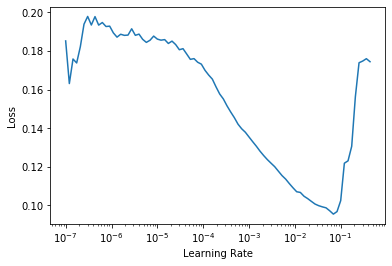
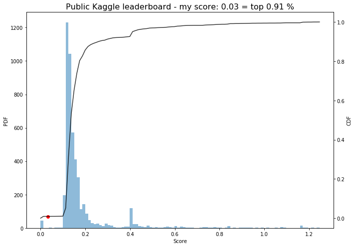
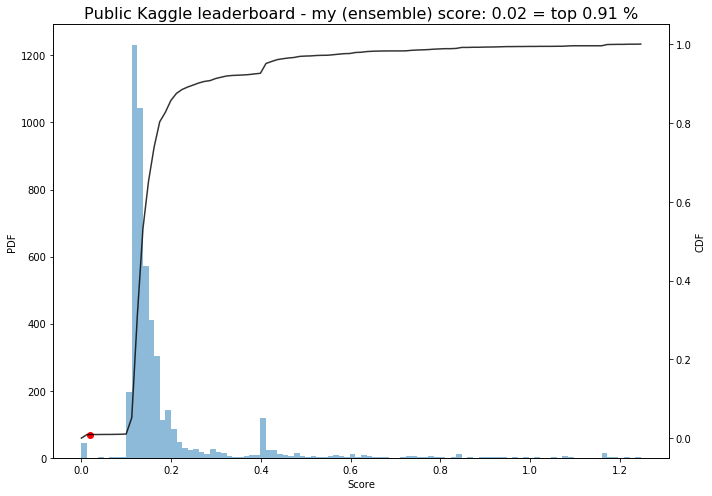
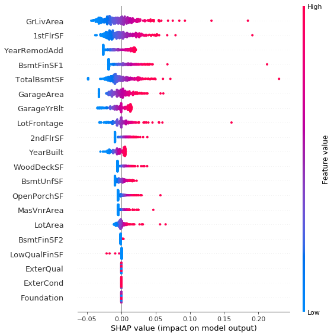

# Kaggle house prices with fastai v2
> Kaggling with fastai2


## Get leaderboard and competition data

```python
# !kaggle competitions leaderboard {competition} -d -p {dir_leaderboard}
```

```python
# !kaggle competitions download -c {competition} -p {dir_raw_data}
```

```python
# extract_zip_files(compressed_leaderboard_file)
```

```python
# extract_zip_files(compressed_data_file)
```

## Preprocessing

```python
df = pd.read_csv(train_path)
df_test = pd.read_csv(test_path)
```

```python
display_all(df_test.head().T)
```


<div>
<style scoped>
    .dataframe tbody tr th:only-of-type {
        vertical-align: middle;
    }

    .dataframe tbody tr th {
        vertical-align: top;
    }

    .dataframe thead th {
        text-align: right;
    }
</style>
<table border="1" class="dataframe">
  <thead>
    <tr style="text-align: right;">
      <th></th>
      <th>0</th>
      <th>1</th>
      <th>2</th>
      <th>3</th>
      <th>4</th>
    </tr>
  </thead>
  <tbody>
    <tr>
      <th>Id</th>
      <td>1461</td>
      <td>1462</td>
      <td>1463</td>
      <td>1464</td>
      <td>1465</td>
    </tr>
    <tr>
      <th>MSSubClass</th>
      <td>20</td>
      <td>20</td>
      <td>60</td>
      <td>60</td>
      <td>120</td>
    </tr>
    <tr>
      <th>MSZoning</th>
      <td>RH</td>
      <td>RL</td>
      <td>RL</td>
      <td>RL</td>
      <td>RL</td>
    </tr>
    <tr>
      <th>LotFrontage</th>
      <td>80</td>
      <td>81</td>
      <td>74</td>
      <td>78</td>
      <td>43</td>
    </tr>
    <tr>
      <th>LotArea</th>
      <td>11622</td>
      <td>14267</td>
      <td>13830</td>
      <td>9978</td>
      <td>5005</td>
    </tr>
    <tr>
      <th>Street</th>
      <td>Pave</td>
      <td>Pave</td>
      <td>Pave</td>
      <td>Pave</td>
      <td>Pave</td>
    </tr>
    <tr>
      <th>Alley</th>
      <td>NaN</td>
      <td>NaN</td>
      <td>NaN</td>
      <td>NaN</td>
      <td>NaN</td>
    </tr>
    <tr>
      <th>LotShape</th>
      <td>Reg</td>
      <td>IR1</td>
      <td>IR1</td>
      <td>IR1</td>
      <td>IR1</td>
    </tr>
    <tr>
      <th>LandContour</th>
      <td>Lvl</td>
      <td>Lvl</td>
      <td>Lvl</td>
      <td>Lvl</td>
      <td>HLS</td>
    </tr>
    <tr>
      <th>Utilities</th>
      <td>AllPub</td>
      <td>AllPub</td>
      <td>AllPub</td>
      <td>AllPub</td>
      <td>AllPub</td>
    </tr>
    <tr>
      <th>LotConfig</th>
      <td>Inside</td>
      <td>Corner</td>
      <td>Inside</td>
      <td>Inside</td>
      <td>Inside</td>
    </tr>
    <tr>
      <th>LandSlope</th>
      <td>Gtl</td>
      <td>Gtl</td>
      <td>Gtl</td>
      <td>Gtl</td>
      <td>Gtl</td>
    </tr>
    <tr>
      <th>Neighborhood</th>
      <td>NAmes</td>
      <td>NAmes</td>
      <td>Gilbert</td>
      <td>Gilbert</td>
      <td>StoneBr</td>
    </tr>
    <tr>
      <th>Condition1</th>
      <td>Feedr</td>
      <td>Norm</td>
      <td>Norm</td>
      <td>Norm</td>
      <td>Norm</td>
    </tr>
    <tr>
      <th>Condition2</th>
      <td>Norm</td>
      <td>Norm</td>
      <td>Norm</td>
      <td>Norm</td>
      <td>Norm</td>
    </tr>
    <tr>
      <th>BldgType</th>
      <td>1Fam</td>
      <td>1Fam</td>
      <td>1Fam</td>
      <td>1Fam</td>
      <td>TwnhsE</td>
    </tr>
    <tr>
      <th>HouseStyle</th>
      <td>1Story</td>
      <td>1Story</td>
      <td>2Story</td>
      <td>2Story</td>
      <td>1Story</td>
    </tr>
    <tr>
      <th>OverallQual</th>
      <td>5</td>
      <td>6</td>
      <td>5</td>
      <td>6</td>
      <td>8</td>
    </tr>
    <tr>
      <th>OverallCond</th>
      <td>6</td>
      <td>6</td>
      <td>5</td>
      <td>6</td>
      <td>5</td>
    </tr>
    <tr>
      <th>YearBuilt</th>
      <td>1961</td>
      <td>1958</td>
      <td>1997</td>
      <td>1998</td>
      <td>1992</td>
    </tr>
    <tr>
      <th>YearRemodAdd</th>
      <td>1961</td>
      <td>1958</td>
      <td>1998</td>
      <td>1998</td>
      <td>1992</td>
    </tr>
    <tr>
      <th>RoofStyle</th>
      <td>Gable</td>
      <td>Hip</td>
      <td>Gable</td>
      <td>Gable</td>
      <td>Gable</td>
    </tr>
    <tr>
      <th>RoofMatl</th>
      <td>CompShg</td>
      <td>CompShg</td>
      <td>CompShg</td>
      <td>CompShg</td>
      <td>CompShg</td>
    </tr>
    <tr>
      <th>Exterior1st</th>
      <td>VinylSd</td>
      <td>Wd Sdng</td>
      <td>VinylSd</td>
      <td>VinylSd</td>
      <td>HdBoard</td>
    </tr>
    <tr>
      <th>Exterior2nd</th>
      <td>VinylSd</td>
      <td>Wd Sdng</td>
      <td>VinylSd</td>
      <td>VinylSd</td>
      <td>HdBoard</td>
    </tr>
    <tr>
      <th>MasVnrType</th>
      <td>None</td>
      <td>BrkFace</td>
      <td>None</td>
      <td>BrkFace</td>
      <td>None</td>
    </tr>
    <tr>
      <th>MasVnrArea</th>
      <td>0</td>
      <td>108</td>
      <td>0</td>
      <td>20</td>
      <td>0</td>
    </tr>
    <tr>
      <th>ExterQual</th>
      <td>TA</td>
      <td>TA</td>
      <td>TA</td>
      <td>TA</td>
      <td>Gd</td>
    </tr>
    <tr>
      <th>ExterCond</th>
      <td>TA</td>
      <td>TA</td>
      <td>TA</td>
      <td>TA</td>
      <td>TA</td>
    </tr>
    <tr>
      <th>Foundation</th>
      <td>CBlock</td>
      <td>CBlock</td>
      <td>PConc</td>
      <td>PConc</td>
      <td>PConc</td>
    </tr>
    <tr>
      <th>BsmtQual</th>
      <td>TA</td>
      <td>TA</td>
      <td>Gd</td>
      <td>TA</td>
      <td>Gd</td>
    </tr>
    <tr>
      <th>BsmtCond</th>
      <td>TA</td>
      <td>TA</td>
      <td>TA</td>
      <td>TA</td>
      <td>TA</td>
    </tr>
    <tr>
      <th>BsmtExposure</th>
      <td>No</td>
      <td>No</td>
      <td>No</td>
      <td>No</td>
      <td>No</td>
    </tr>
    <tr>
      <th>BsmtFinType1</th>
      <td>Rec</td>
      <td>ALQ</td>
      <td>GLQ</td>
      <td>GLQ</td>
      <td>ALQ</td>
    </tr>
    <tr>
      <th>BsmtFinSF1</th>
      <td>468</td>
      <td>923</td>
      <td>791</td>
      <td>602</td>
      <td>263</td>
    </tr>
    <tr>
      <th>BsmtFinType2</th>
      <td>LwQ</td>
      <td>Unf</td>
      <td>Unf</td>
      <td>Unf</td>
      <td>Unf</td>
    </tr>
    <tr>
      <th>BsmtFinSF2</th>
      <td>144</td>
      <td>0</td>
      <td>0</td>
      <td>0</td>
      <td>0</td>
    </tr>
    <tr>
      <th>BsmtUnfSF</th>
      <td>270</td>
      <td>406</td>
      <td>137</td>
      <td>324</td>
      <td>1017</td>
    </tr>
    <tr>
      <th>TotalBsmtSF</th>
      <td>882</td>
      <td>1329</td>
      <td>928</td>
      <td>926</td>
      <td>1280</td>
    </tr>
    <tr>
      <th>Heating</th>
      <td>GasA</td>
      <td>GasA</td>
      <td>GasA</td>
      <td>GasA</td>
      <td>GasA</td>
    </tr>
    <tr>
      <th>HeatingQC</th>
      <td>TA</td>
      <td>TA</td>
      <td>Gd</td>
      <td>Ex</td>
      <td>Ex</td>
    </tr>
    <tr>
      <th>CentralAir</th>
      <td>Y</td>
      <td>Y</td>
      <td>Y</td>
      <td>Y</td>
      <td>Y</td>
    </tr>
    <tr>
      <th>Electrical</th>
      <td>SBrkr</td>
      <td>SBrkr</td>
      <td>SBrkr</td>
      <td>SBrkr</td>
      <td>SBrkr</td>
    </tr>
    <tr>
      <th>1stFlrSF</th>
      <td>896</td>
      <td>1329</td>
      <td>928</td>
      <td>926</td>
      <td>1280</td>
    </tr>
    <tr>
      <th>2ndFlrSF</th>
      <td>0</td>
      <td>0</td>
      <td>701</td>
      <td>678</td>
      <td>0</td>
    </tr>
    <tr>
      <th>LowQualFinSF</th>
      <td>0</td>
      <td>0</td>
      <td>0</td>
      <td>0</td>
      <td>0</td>
    </tr>
    <tr>
      <th>GrLivArea</th>
      <td>896</td>
      <td>1329</td>
      <td>1629</td>
      <td>1604</td>
      <td>1280</td>
    </tr>
    <tr>
      <th>BsmtFullBath</th>
      <td>0</td>
      <td>0</td>
      <td>0</td>
      <td>0</td>
      <td>0</td>
    </tr>
    <tr>
      <th>BsmtHalfBath</th>
      <td>0</td>
      <td>0</td>
      <td>0</td>
      <td>0</td>
      <td>0</td>
    </tr>
    <tr>
      <th>FullBath</th>
      <td>1</td>
      <td>1</td>
      <td>2</td>
      <td>2</td>
      <td>2</td>
    </tr>
    <tr>
      <th>HalfBath</th>
      <td>0</td>
      <td>1</td>
      <td>1</td>
      <td>1</td>
      <td>0</td>
    </tr>
    <tr>
      <th>BedroomAbvGr</th>
      <td>2</td>
      <td>3</td>
      <td>3</td>
      <td>3</td>
      <td>2</td>
    </tr>
    <tr>
      <th>KitchenAbvGr</th>
      <td>1</td>
      <td>1</td>
      <td>1</td>
      <td>1</td>
      <td>1</td>
    </tr>
    <tr>
      <th>KitchenQual</th>
      <td>TA</td>
      <td>Gd</td>
      <td>TA</td>
      <td>Gd</td>
      <td>Gd</td>
    </tr>
    <tr>
      <th>TotRmsAbvGrd</th>
      <td>5</td>
      <td>6</td>
      <td>6</td>
      <td>7</td>
      <td>5</td>
    </tr>
    <tr>
      <th>Functional</th>
      <td>Typ</td>
      <td>Typ</td>
      <td>Typ</td>
      <td>Typ</td>
      <td>Typ</td>
    </tr>
    <tr>
      <th>Fireplaces</th>
      <td>0</td>
      <td>0</td>
      <td>1</td>
      <td>1</td>
      <td>0</td>
    </tr>
    <tr>
      <th>FireplaceQu</th>
      <td>NaN</td>
      <td>NaN</td>
      <td>TA</td>
      <td>Gd</td>
      <td>NaN</td>
    </tr>
    <tr>
      <th>GarageType</th>
      <td>Attchd</td>
      <td>Attchd</td>
      <td>Attchd</td>
      <td>Attchd</td>
      <td>Attchd</td>
    </tr>
    <tr>
      <th>GarageYrBlt</th>
      <td>1961</td>
      <td>1958</td>
      <td>1997</td>
      <td>1998</td>
      <td>1992</td>
    </tr>
    <tr>
      <th>GarageFinish</th>
      <td>Unf</td>
      <td>Unf</td>
      <td>Fin</td>
      <td>Fin</td>
      <td>RFn</td>
    </tr>
    <tr>
      <th>GarageCars</th>
      <td>1</td>
      <td>1</td>
      <td>2</td>
      <td>2</td>
      <td>2</td>
    </tr>
    <tr>
      <th>GarageArea</th>
      <td>730</td>
      <td>312</td>
      <td>482</td>
      <td>470</td>
      <td>506</td>
    </tr>
    <tr>
      <th>GarageQual</th>
      <td>TA</td>
      <td>TA</td>
      <td>TA</td>
      <td>TA</td>
      <td>TA</td>
    </tr>
    <tr>
      <th>GarageCond</th>
      <td>TA</td>
      <td>TA</td>
      <td>TA</td>
      <td>TA</td>
      <td>TA</td>
    </tr>
    <tr>
      <th>PavedDrive</th>
      <td>Y</td>
      <td>Y</td>
      <td>Y</td>
      <td>Y</td>
      <td>Y</td>
    </tr>
    <tr>
      <th>WoodDeckSF</th>
      <td>140</td>
      <td>393</td>
      <td>212</td>
      <td>360</td>
      <td>0</td>
    </tr>
    <tr>
      <th>OpenPorchSF</th>
      <td>0</td>
      <td>36</td>
      <td>34</td>
      <td>36</td>
      <td>82</td>
    </tr>
    <tr>
      <th>EnclosedPorch</th>
      <td>0</td>
      <td>0</td>
      <td>0</td>
      <td>0</td>
      <td>0</td>
    </tr>
    <tr>
      <th>3SsnPorch</th>
      <td>0</td>
      <td>0</td>
      <td>0</td>
      <td>0</td>
      <td>0</td>
    </tr>
    <tr>
      <th>ScreenPorch</th>
      <td>120</td>
      <td>0</td>
      <td>0</td>
      <td>0</td>
      <td>144</td>
    </tr>
    <tr>
      <th>PoolArea</th>
      <td>0</td>
      <td>0</td>
      <td>0</td>
      <td>0</td>
      <td>0</td>
    </tr>
    <tr>
      <th>PoolQC</th>
      <td>NaN</td>
      <td>NaN</td>
      <td>NaN</td>
      <td>NaN</td>
      <td>NaN</td>
    </tr>
    <tr>
      <th>Fence</th>
      <td>MnPrv</td>
      <td>NaN</td>
      <td>MnPrv</td>
      <td>NaN</td>
      <td>NaN</td>
    </tr>
    <tr>
      <th>MiscFeature</th>
      <td>NaN</td>
      <td>Gar2</td>
      <td>NaN</td>
      <td>NaN</td>
      <td>NaN</td>
    </tr>
    <tr>
      <th>MiscVal</th>
      <td>0</td>
      <td>12500</td>
      <td>0</td>
      <td>0</td>
      <td>0</td>
    </tr>
    <tr>
      <th>MoSold</th>
      <td>6</td>
      <td>6</td>
      <td>3</td>
      <td>6</td>
      <td>1</td>
    </tr>
    <tr>
      <th>YrSold</th>
      <td>2010</td>
      <td>2010</td>
      <td>2010</td>
      <td>2010</td>
      <td>2010</td>
    </tr>
    <tr>
      <th>SaleType</th>
      <td>WD</td>
      <td>WD</td>
      <td>WD</td>
      <td>WD</td>
      <td>WD</td>
    </tr>
    <tr>
      <th>SaleCondition</th>
      <td>Normal</td>
      <td>Normal</td>
      <td>Normal</td>
      <td>Normal</td>
      <td>Normal</td>
    </tr>
  </tbody>
</table>
</div>


```python
show_na_share(df, cont_names)
```

    MasVnrArea: 0.55 %
    GarageYrBlt: 5.55 %
    LotFrontage: 17.74 %


```python
df = impute_continuous(df, cont_names)
```

```python
show_na_share(df, cat_names)
```

    Alley: 93.77 %
    MasVnrType: 0.55 %
    BsmtQual: 2.53 %
    BsmtCond: 2.53 %
    BsmtExposure: 2.60 %
    BsmtFinType1: 2.53 %
    BsmtFinType2: 2.60 %
    Electrical: 0.07 %
    FireplaceQu: 47.26 %
    GarageType: 5.55 %
    GarageFinish: 5.55 %
    GarageQual: 5.55 %
    GarageCond: 5.55 %
    PoolQC: 99.52 %
    Fence: 80.75 %
    MiscFeature: 96.30 %


```python
df = impute_categorical(df, cat_names)
```

```python
df = get_split(df, valid_pct=.2)
display(df["valid"].value_counts())
```


    False    1168
    True      292
    Name: valid, dtype: int64


```python
df[dep_var] = df[dep_var].apply(np.log)
```

```python
procs = [Categorify, FillMissing, Normalize]
```

```python
splits = ColSplitter(col="valid")(df)
```

```python
to = TabularPandas(df, procs=procs, cat_names=cat_names, cont_names=cont_names,
                   y_names=dep_var, splits=splits)
```

```python
display_all(df.iloc[splits[1]][cat_names].head())
```


<div>
<style scoped>
    .dataframe tbody tr th:only-of-type {
        vertical-align: middle;
    }

    .dataframe tbody tr th {
        vertical-align: top;
    }

    .dataframe thead th {
        text-align: right;
    }
</style>
<table border="1" class="dataframe">
  <thead>
    <tr style="text-align: right;">
      <th></th>
      <th>Id</th>
      <th>MSSubClass</th>
      <th>MSZoning</th>
      <th>Street</th>
      <th>Alley</th>
      <th>LotShape</th>
      <th>LandContour</th>
      <th>Utilities</th>
      <th>LotConfig</th>
      <th>LandSlope</th>
      <th>Neighborhood</th>
      <th>Condition1</th>
      <th>Condition2</th>
      <th>BldgType</th>
      <th>HouseStyle</th>
      <th>OverallQual</th>
      <th>OverallCond</th>
      <th>RoofStyle</th>
      <th>RoofMatl</th>
      <th>Exterior1st</th>
      <th>Exterior2nd</th>
      <th>MasVnrType</th>
      <th>ExterQual</th>
      <th>ExterCond</th>
      <th>Foundation</th>
      <th>BsmtQual</th>
      <th>BsmtCond</th>
      <th>BsmtExposure</th>
      <th>BsmtFinType1</th>
      <th>BsmtFinType2</th>
      <th>Heating</th>
      <th>HeatingQC</th>
      <th>CentralAir</th>
      <th>Electrical</th>
      <th>BsmtFullBath</th>
      <th>BsmtHalfBath</th>
      <th>FullBath</th>
      <th>HalfBath</th>
      <th>BedroomAbvGr</th>
      <th>KitchenAbvGr</th>
      <th>KitchenQual</th>
      <th>TotRmsAbvGrd</th>
      <th>Functional</th>
      <th>Fireplaces</th>
      <th>FireplaceQu</th>
      <th>GarageType</th>
      <th>GarageFinish</th>
      <th>GarageCars</th>
      <th>GarageQual</th>
      <th>GarageCond</th>
      <th>PavedDrive</th>
      <th>EnclosedPorch</th>
      <th>3SsnPorch</th>
      <th>ScreenPorch</th>
      <th>PoolArea</th>
      <th>PoolQC</th>
      <th>Fence</th>
      <th>MiscFeature</th>
      <th>MiscVal</th>
      <th>MoSold</th>
      <th>SaleType</th>
      <th>SaleCondition</th>
      <th>LotArea_na</th>
      <th>YearBuilt_na</th>
      <th>YearRemodAdd_na</th>
      <th>MasVnrArea_na</th>
      <th>BsmtFinSF2_na</th>
      <th>BsmtUnfSF_na</th>
      <th>TotalBsmtSF_na</th>
      <th>1stFlrSF_na</th>
      <th>2ndFlrSF_na</th>
      <th>GrLivArea_na</th>
      <th>GarageYrBlt_na</th>
      <th>GarageArea_na</th>
      <th>WoodDeckSF_na</th>
      <th>OpenPorchSF_na</th>
      <th>LotFrontage_na</th>
      <th>BsmtFinSF1_na</th>
      <th>LowQualFinSF_na</th>
    </tr>
  </thead>
  <tbody>
    <tr>
      <th>1168</th>
      <td>1169</td>
      <td>70</td>
      <td>RL</td>
      <td>Pave</td>
      <td>NA</td>
      <td>Reg</td>
      <td>Lvl</td>
      <td>AllPub</td>
      <td>Corner</td>
      <td>Gtl</td>
      <td>Edwards</td>
      <td>Norm</td>
      <td>Norm</td>
      <td>1Fam</td>
      <td>2Story</td>
      <td>6</td>
      <td>7</td>
      <td>Hip</td>
      <td>CompShg</td>
      <td>Stucco</td>
      <td>Stucco</td>
      <td>None</td>
      <td>TA</td>
      <td>TA</td>
      <td>CBlock</td>
      <td>TA</td>
      <td>TA</td>
      <td>No</td>
      <td>Rec</td>
      <td>Unf</td>
      <td>GasA</td>
      <td>Ex</td>
      <td>Y</td>
      <td>SBrkr</td>
      <td>0</td>
      <td>0</td>
      <td>2</td>
      <td>0</td>
      <td>4</td>
      <td>1</td>
      <td>Gd</td>
      <td>7</td>
      <td>Typ</td>
      <td>2</td>
      <td>TA</td>
      <td>Basment</td>
      <td>Unf</td>
      <td>2</td>
      <td>TA</td>
      <td>TA</td>
      <td>Y</td>
      <td>0</td>
      <td>0</td>
      <td>90</td>
      <td>0</td>
      <td>NA</td>
      <td>NA</td>
      <td>NA</td>
      <td>0</td>
      <td>7</td>
      <td>WD</td>
      <td>Normal</td>
      <td>False</td>
      <td>False</td>
      <td>False</td>
      <td>False</td>
      <td>False</td>
      <td>False</td>
      <td>False</td>
      <td>False</td>
      <td>False</td>
      <td>False</td>
      <td>False</td>
      <td>False</td>
      <td>False</td>
      <td>False</td>
      <td>False</td>
      <td>False</td>
      <td>False</td>
    </tr>
    <tr>
      <th>1169</th>
      <td>1170</td>
      <td>60</td>
      <td>RL</td>
      <td>Pave</td>
      <td>NA</td>
      <td>IR1</td>
      <td>Lvl</td>
      <td>AllPub</td>
      <td>CulDSac</td>
      <td>Gtl</td>
      <td>NoRidge</td>
      <td>Norm</td>
      <td>Norm</td>
      <td>1Fam</td>
      <td>2Story</td>
      <td>10</td>
      <td>5</td>
      <td>Hip</td>
      <td>CompShg</td>
      <td>HdBoard</td>
      <td>HdBoard</td>
      <td>BrkFace</td>
      <td>Gd</td>
      <td>Gd</td>
      <td>PConc</td>
      <td>Ex</td>
      <td>TA</td>
      <td>Gd</td>
      <td>GLQ</td>
      <td>Unf</td>
      <td>GasA</td>
      <td>Ex</td>
      <td>Y</td>
      <td>SBrkr</td>
      <td>1</td>
      <td>0</td>
      <td>3</td>
      <td>1</td>
      <td>4</td>
      <td>1</td>
      <td>Gd</td>
      <td>10</td>
      <td>Typ</td>
      <td>1</td>
      <td>TA</td>
      <td>Attchd</td>
      <td>Fin</td>
      <td>3</td>
      <td>TA</td>
      <td>TA</td>
      <td>Y</td>
      <td>0</td>
      <td>0</td>
      <td>0</td>
      <td>0</td>
      <td>NA</td>
      <td>NA</td>
      <td>NA</td>
      <td>0</td>
      <td>7</td>
      <td>WD</td>
      <td>Normal</td>
      <td>False</td>
      <td>False</td>
      <td>False</td>
      <td>False</td>
      <td>False</td>
      <td>False</td>
      <td>False</td>
      <td>False</td>
      <td>False</td>
      <td>False</td>
      <td>False</td>
      <td>False</td>
      <td>False</td>
      <td>False</td>
      <td>False</td>
      <td>False</td>
      <td>False</td>
    </tr>
    <tr>
      <th>1170</th>
      <td>1171</td>
      <td>80</td>
      <td>RL</td>
      <td>Pave</td>
      <td>NA</td>
      <td>Reg</td>
      <td>Lvl</td>
      <td>AllPub</td>
      <td>Inside</td>
      <td>Gtl</td>
      <td>Mitchel</td>
      <td>Norm</td>
      <td>Norm</td>
      <td>1Fam</td>
      <td>SLvl</td>
      <td>6</td>
      <td>6</td>
      <td>Gable</td>
      <td>CompShg</td>
      <td>Plywood</td>
      <td>Plywood</td>
      <td>None</td>
      <td>TA</td>
      <td>TA</td>
      <td>CBlock</td>
      <td>TA</td>
      <td>TA</td>
      <td>Av</td>
      <td>ALQ</td>
      <td>Unf</td>
      <td>GasA</td>
      <td>TA</td>
      <td>Y</td>
      <td>SBrkr</td>
      <td>1</td>
      <td>0</td>
      <td>1</td>
      <td>0</td>
      <td>3</td>
      <td>1</td>
      <td>TA</td>
      <td>6</td>
      <td>Typ</td>
      <td>1</td>
      <td>Po</td>
      <td>Attchd</td>
      <td>Fin</td>
      <td>1</td>
      <td>TA</td>
      <td>TA</td>
      <td>Y</td>
      <td>0</td>
      <td>0</td>
      <td>0</td>
      <td>576</td>
      <td>Gd</td>
      <td>GdPrv</td>
      <td>NA</td>
      <td>0</td>
      <td>7</td>
      <td>WD</td>
      <td>Normal</td>
      <td>False</td>
      <td>False</td>
      <td>False</td>
      <td>False</td>
      <td>False</td>
      <td>False</td>
      <td>False</td>
      <td>False</td>
      <td>False</td>
      <td>False</td>
      <td>False</td>
      <td>False</td>
      <td>False</td>
      <td>False</td>
      <td>False</td>
      <td>False</td>
      <td>False</td>
    </tr>
    <tr>
      <th>1171</th>
      <td>1172</td>
      <td>20</td>
      <td>RL</td>
      <td>Pave</td>
      <td>NA</td>
      <td>Reg</td>
      <td>Lvl</td>
      <td>AllPub</td>
      <td>Inside</td>
      <td>Gtl</td>
      <td>NAmes</td>
      <td>Norm</td>
      <td>Norm</td>
      <td>1Fam</td>
      <td>1Story</td>
      <td>6</td>
      <td>6</td>
      <td>Hip</td>
      <td>CompShg</td>
      <td>MetalSd</td>
      <td>MetalSd</td>
      <td>None</td>
      <td>TA</td>
      <td>TA</td>
      <td>CBlock</td>
      <td>TA</td>
      <td>TA</td>
      <td>No</td>
      <td>ALQ</td>
      <td>Unf</td>
      <td>GasA</td>
      <td>Ex</td>
      <td>Y</td>
      <td>SBrkr</td>
      <td>1</td>
      <td>0</td>
      <td>1</td>
      <td>0</td>
      <td>3</td>
      <td>1</td>
      <td>TA</td>
      <td>6</td>
      <td>Typ</td>
      <td>1</td>
      <td>TA</td>
      <td>Attchd</td>
      <td>RFn</td>
      <td>2</td>
      <td>TA</td>
      <td>TA</td>
      <td>Y</td>
      <td>0</td>
      <td>0</td>
      <td>288</td>
      <td>0</td>
      <td>NA</td>
      <td>NA</td>
      <td>Shed</td>
      <td>1400</td>
      <td>11</td>
      <td>WD</td>
      <td>Normal</td>
      <td>False</td>
      <td>False</td>
      <td>False</td>
      <td>False</td>
      <td>False</td>
      <td>False</td>
      <td>False</td>
      <td>False</td>
      <td>False</td>
      <td>False</td>
      <td>False</td>
      <td>False</td>
      <td>False</td>
      <td>False</td>
      <td>False</td>
      <td>False</td>
      <td>False</td>
    </tr>
    <tr>
      <th>1172</th>
      <td>1173</td>
      <td>160</td>
      <td>FV</td>
      <td>Pave</td>
      <td>Pave</td>
      <td>IR1</td>
      <td>Lvl</td>
      <td>AllPub</td>
      <td>Inside</td>
      <td>Gtl</td>
      <td>Somerst</td>
      <td>Norm</td>
      <td>Norm</td>
      <td>TwnhsE</td>
      <td>2Story</td>
      <td>7</td>
      <td>5</td>
      <td>Gable</td>
      <td>CompShg</td>
      <td>MetalSd</td>
      <td>MetalSd</td>
      <td>None</td>
      <td>Gd</td>
      <td>TA</td>
      <td>PConc</td>
      <td>Gd</td>
      <td>TA</td>
      <td>No</td>
      <td>Unf</td>
      <td>Unf</td>
      <td>GasA</td>
      <td>Ex</td>
      <td>Y</td>
      <td>SBrkr</td>
      <td>0</td>
      <td>0</td>
      <td>2</td>
      <td>1</td>
      <td>2</td>
      <td>1</td>
      <td>Gd</td>
      <td>5</td>
      <td>Typ</td>
      <td>0</td>
      <td>NA</td>
      <td>Detchd</td>
      <td>Fin</td>
      <td>2</td>
      <td>TA</td>
      <td>TA</td>
      <td>Y</td>
      <td>0</td>
      <td>0</td>
      <td>0</td>
      <td>0</td>
      <td>NA</td>
      <td>NA</td>
      <td>NA</td>
      <td>0</td>
      <td>3</td>
      <td>WD</td>
      <td>Normal</td>
      <td>False</td>
      <td>False</td>
      <td>False</td>
      <td>False</td>
      <td>False</td>
      <td>False</td>
      <td>False</td>
      <td>False</td>
      <td>False</td>
      <td>False</td>
      <td>False</td>
      <td>False</td>
      <td>False</td>
      <td>False</td>
      <td>False</td>
      <td>False</td>
      <td>False</td>
    </tr>
  </tbody>
</table>
</div>


```python
display_all(to.valid.xs[cat_names].head())
```


<div>
<style scoped>
    .dataframe tbody tr th:only-of-type {
        vertical-align: middle;
    }

    .dataframe tbody tr th {
        vertical-align: top;
    }

    .dataframe thead th {
        text-align: right;
    }
</style>
<table border="1" class="dataframe">
  <thead>
    <tr style="text-align: right;">
      <th></th>
      <th>Id</th>
      <th>MSSubClass</th>
      <th>MSZoning</th>
      <th>Street</th>
      <th>Alley</th>
      <th>LotShape</th>
      <th>LandContour</th>
      <th>Utilities</th>
      <th>LotConfig</th>
      <th>LandSlope</th>
      <th>Neighborhood</th>
      <th>Condition1</th>
      <th>Condition2</th>
      <th>BldgType</th>
      <th>HouseStyle</th>
      <th>OverallQual</th>
      <th>OverallCond</th>
      <th>RoofStyle</th>
      <th>RoofMatl</th>
      <th>Exterior1st</th>
      <th>Exterior2nd</th>
      <th>MasVnrType</th>
      <th>ExterQual</th>
      <th>ExterCond</th>
      <th>Foundation</th>
      <th>BsmtQual</th>
      <th>BsmtCond</th>
      <th>BsmtExposure</th>
      <th>BsmtFinType1</th>
      <th>BsmtFinType2</th>
      <th>Heating</th>
      <th>HeatingQC</th>
      <th>CentralAir</th>
      <th>Electrical</th>
      <th>BsmtFullBath</th>
      <th>BsmtHalfBath</th>
      <th>FullBath</th>
      <th>HalfBath</th>
      <th>BedroomAbvGr</th>
      <th>KitchenAbvGr</th>
      <th>KitchenQual</th>
      <th>TotRmsAbvGrd</th>
      <th>Functional</th>
      <th>Fireplaces</th>
      <th>FireplaceQu</th>
      <th>GarageType</th>
      <th>GarageFinish</th>
      <th>GarageCars</th>
      <th>GarageQual</th>
      <th>GarageCond</th>
      <th>PavedDrive</th>
      <th>EnclosedPorch</th>
      <th>3SsnPorch</th>
      <th>ScreenPorch</th>
      <th>PoolArea</th>
      <th>PoolQC</th>
      <th>Fence</th>
      <th>MiscFeature</th>
      <th>MiscVal</th>
      <th>MoSold</th>
      <th>SaleType</th>
      <th>SaleCondition</th>
      <th>LotArea_na</th>
      <th>YearBuilt_na</th>
      <th>YearRemodAdd_na</th>
      <th>MasVnrArea_na</th>
      <th>BsmtFinSF2_na</th>
      <th>BsmtUnfSF_na</th>
      <th>TotalBsmtSF_na</th>
      <th>1stFlrSF_na</th>
      <th>2ndFlrSF_na</th>
      <th>GrLivArea_na</th>
      <th>GarageYrBlt_na</th>
      <th>GarageArea_na</th>
      <th>WoodDeckSF_na</th>
      <th>OpenPorchSF_na</th>
      <th>LotFrontage_na</th>
      <th>BsmtFinSF1_na</th>
      <th>LowQualFinSF_na</th>
    </tr>
  </thead>
  <tbody>
    <tr>
      <th>1168</th>
      <td>0</td>
      <td>7</td>
      <td>4</td>
      <td>2</td>
      <td>2</td>
      <td>4</td>
      <td>4</td>
      <td>1</td>
      <td>1</td>
      <td>1</td>
      <td>8</td>
      <td>3</td>
      <td>3</td>
      <td>1</td>
      <td>6</td>
      <td>6</td>
      <td>7</td>
      <td>4</td>
      <td>1</td>
      <td>10</td>
      <td>12</td>
      <td>4</td>
      <td>4</td>
      <td>5</td>
      <td>2</td>
      <td>5</td>
      <td>5</td>
      <td>5</td>
      <td>6</td>
      <td>7</td>
      <td>1</td>
      <td>1</td>
      <td>2</td>
      <td>5</td>
      <td>1</td>
      <td>1</td>
      <td>3</td>
      <td>1</td>
      <td>5</td>
      <td>2</td>
      <td>3</td>
      <td>6</td>
      <td>7</td>
      <td>3</td>
      <td>6</td>
      <td>3</td>
      <td>4</td>
      <td>3</td>
      <td>6</td>
      <td>6</td>
      <td>3</td>
      <td>1</td>
      <td>1</td>
      <td>5</td>
      <td>1</td>
      <td>3</td>
      <td>5</td>
      <td>2</td>
      <td>1</td>
      <td>7</td>
      <td>9</td>
      <td>5</td>
      <td>1</td>
      <td>1</td>
      <td>1</td>
      <td>1</td>
      <td>1</td>
      <td>1</td>
      <td>1</td>
      <td>1</td>
      <td>1</td>
      <td>1</td>
      <td>1</td>
      <td>1</td>
      <td>1</td>
      <td>1</td>
      <td>1</td>
      <td>1</td>
      <td>1</td>
    </tr>
    <tr>
      <th>1169</th>
      <td>0</td>
      <td>6</td>
      <td>4</td>
      <td>2</td>
      <td>2</td>
      <td>1</td>
      <td>4</td>
      <td>1</td>
      <td>2</td>
      <td>1</td>
      <td>16</td>
      <td>3</td>
      <td>3</td>
      <td>1</td>
      <td>6</td>
      <td>10</td>
      <td>5</td>
      <td>4</td>
      <td>1</td>
      <td>6</td>
      <td>6</td>
      <td>2</td>
      <td>3</td>
      <td>3</td>
      <td>3</td>
      <td>1</td>
      <td>5</td>
      <td>2</td>
      <td>3</td>
      <td>7</td>
      <td>1</td>
      <td>1</td>
      <td>2</td>
      <td>5</td>
      <td>2</td>
      <td>1</td>
      <td>4</td>
      <td>2</td>
      <td>5</td>
      <td>2</td>
      <td>3</td>
      <td>9</td>
      <td>7</td>
      <td>2</td>
      <td>6</td>
      <td>2</td>
      <td>1</td>
      <td>4</td>
      <td>6</td>
      <td>6</td>
      <td>3</td>
      <td>1</td>
      <td>1</td>
      <td>1</td>
      <td>1</td>
      <td>3</td>
      <td>5</td>
      <td>2</td>
      <td>1</td>
      <td>7</td>
      <td>9</td>
      <td>5</td>
      <td>1</td>
      <td>1</td>
      <td>1</td>
      <td>1</td>
      <td>1</td>
      <td>1</td>
      <td>1</td>
      <td>1</td>
      <td>1</td>
      <td>1</td>
      <td>1</td>
      <td>1</td>
      <td>1</td>
      <td>1</td>
      <td>1</td>
      <td>1</td>
      <td>1</td>
    </tr>
    <tr>
      <th>1170</th>
      <td>0</td>
      <td>9</td>
      <td>4</td>
      <td>2</td>
      <td>2</td>
      <td>4</td>
      <td>4</td>
      <td>1</td>
      <td>5</td>
      <td>1</td>
      <td>12</td>
      <td>3</td>
      <td>3</td>
      <td>1</td>
      <td>8</td>
      <td>6</td>
      <td>6</td>
      <td>2</td>
      <td>1</td>
      <td>8</td>
      <td>10</td>
      <td>4</td>
      <td>4</td>
      <td>5</td>
      <td>2</td>
      <td>5</td>
      <td>5</td>
      <td>1</td>
      <td>1</td>
      <td>7</td>
      <td>1</td>
      <td>5</td>
      <td>2</td>
      <td>5</td>
      <td>2</td>
      <td>1</td>
      <td>2</td>
      <td>1</td>
      <td>4</td>
      <td>2</td>
      <td>4</td>
      <td>5</td>
      <td>7</td>
      <td>2</td>
      <td>5</td>
      <td>2</td>
      <td>1</td>
      <td>2</td>
      <td>6</td>
      <td>6</td>
      <td>3</td>
      <td>1</td>
      <td>1</td>
      <td>1</td>
      <td>0</td>
      <td>0</td>
      <td>1</td>
      <td>2</td>
      <td>1</td>
      <td>7</td>
      <td>9</td>
      <td>5</td>
      <td>1</td>
      <td>1</td>
      <td>1</td>
      <td>1</td>
      <td>1</td>
      <td>1</td>
      <td>1</td>
      <td>1</td>
      <td>1</td>
      <td>1</td>
      <td>1</td>
      <td>1</td>
      <td>1</td>
      <td>1</td>
      <td>1</td>
      <td>1</td>
      <td>1</td>
    </tr>
    <tr>
      <th>1171</th>
      <td>0</td>
      <td>1</td>
      <td>4</td>
      <td>2</td>
      <td>2</td>
      <td>4</td>
      <td>4</td>
      <td>1</td>
      <td>5</td>
      <td>1</td>
      <td>13</td>
      <td>3</td>
      <td>3</td>
      <td>1</td>
      <td>3</td>
      <td>6</td>
      <td>6</td>
      <td>4</td>
      <td>1</td>
      <td>7</td>
      <td>8</td>
      <td>4</td>
      <td>4</td>
      <td>5</td>
      <td>2</td>
      <td>5</td>
      <td>5</td>
      <td>5</td>
      <td>1</td>
      <td>7</td>
      <td>1</td>
      <td>1</td>
      <td>2</td>
      <td>5</td>
      <td>2</td>
      <td>1</td>
      <td>2</td>
      <td>1</td>
      <td>4</td>
      <td>2</td>
      <td>4</td>
      <td>5</td>
      <td>7</td>
      <td>2</td>
      <td>6</td>
      <td>2</td>
      <td>3</td>
      <td>3</td>
      <td>6</td>
      <td>6</td>
      <td>3</td>
      <td>1</td>
      <td>1</td>
      <td>0</td>
      <td>1</td>
      <td>3</td>
      <td>5</td>
      <td>4</td>
      <td>0</td>
      <td>11</td>
      <td>9</td>
      <td>5</td>
      <td>1</td>
      <td>1</td>
      <td>1</td>
      <td>1</td>
      <td>1</td>
      <td>1</td>
      <td>1</td>
      <td>1</td>
      <td>1</td>
      <td>1</td>
      <td>1</td>
      <td>1</td>
      <td>1</td>
      <td>1</td>
      <td>1</td>
      <td>1</td>
      <td>1</td>
    </tr>
    <tr>
      <th>1172</th>
      <td>0</td>
      <td>13</td>
      <td>2</td>
      <td>2</td>
      <td>3</td>
      <td>1</td>
      <td>4</td>
      <td>1</td>
      <td>5</td>
      <td>1</td>
      <td>22</td>
      <td>3</td>
      <td>3</td>
      <td>5</td>
      <td>6</td>
      <td>7</td>
      <td>5</td>
      <td>2</td>
      <td>1</td>
      <td>7</td>
      <td>8</td>
      <td>4</td>
      <td>3</td>
      <td>5</td>
      <td>3</td>
      <td>3</td>
      <td>5</td>
      <td>5</td>
      <td>7</td>
      <td>7</td>
      <td>1</td>
      <td>1</td>
      <td>2</td>
      <td>5</td>
      <td>1</td>
      <td>1</td>
      <td>3</td>
      <td>2</td>
      <td>3</td>
      <td>2</td>
      <td>3</td>
      <td>4</td>
      <td>7</td>
      <td>1</td>
      <td>4</td>
      <td>6</td>
      <td>1</td>
      <td>3</td>
      <td>6</td>
      <td>6</td>
      <td>3</td>
      <td>1</td>
      <td>1</td>
      <td>1</td>
      <td>1</td>
      <td>3</td>
      <td>5</td>
      <td>2</td>
      <td>1</td>
      <td>3</td>
      <td>9</td>
      <td>5</td>
      <td>1</td>
      <td>1</td>
      <td>1</td>
      <td>1</td>
      <td>1</td>
      <td>1</td>
      <td>1</td>
      <td>1</td>
      <td>1</td>
      <td>1</td>
      <td>1</td>
      <td>1</td>
      <td>1</td>
      <td>1</td>
      <td>1</td>
      <td>1</td>
      <td>1</td>
    </tr>
  </tbody>
</table>
</div>


```python
dls = to.dataloaders()
```

## Fitting a deep net model using `TabularLearner`

```python
loss_fun = torch.nn.functional.mse_loss
```

```python
y_range = [min(to.valid.ys.values.min(), to.train.ys.values.min()), 
           max(to.valid.ys.values.max(), to.train.ys.values.max())]; y_range
```


[10.460242108190519, 13.534473028231162]


```python
%%time
learn = tabular_learner(dls, n_out=1, loss_func=loss_fun, config=dict(active_fun=Mish),
                        y_range=y_range)
```

    CPU times: user 78.1 ms, sys: 0 ns, total: 78.1 ms
    Wall time: 26.1 ms


```python
%%time
learn.lr_find()
```


    CPU times: user 21.2 s, sys: 17.9 s, total: 39.2 s
    Wall time: 5.82 s


    (0.006918309628963471, 3.019951861915615e-07)





```python
%%time
learn.fit_one_cycle(5, 1e-3)
```


<table border="1" class="dataframe">
  <thead>
    <tr style="text-align: left;">
      <th>epoch</th>
      <th>train_loss</th>
      <th>valid_loss</th>
      <th>time</th>
    </tr>
  </thead>
  <tbody>
    <tr>
      <td>0</td>
      <td>0.096877</td>
      <td>0.107682</td>
      <td>00:01</td>
    </tr>
    <tr>
      <td>1</td>
      <td>0.055077</td>
      <td>0.090318</td>
      <td>00:01</td>
    </tr>
    <tr>
      <td>2</td>
      <td>0.036028</td>
      <td>0.079071</td>
      <td>00:01</td>
    </tr>
    <tr>
      <td>3</td>
      <td>0.024554</td>
      <td>0.053626</td>
      <td>00:01</td>
    </tr>
    <tr>
      <td>4</td>
      <td>0.017457</td>
      <td>0.032267</td>
      <td>00:01</td>
    </tr>
  </tbody>
</table>


    CPU times: user 23.7 s, sys: 20.3 s, total: 44 s
    Wall time: 6.6 s


```python
y_pred, y_true = learn.get_preds()

y_pred[:5], y_true[:5]
```


    (tensor([[12.1513],
             [12.8520],
             [11.8932],
             [11.9280],
             [11.9397]]),
     tensor([[12.3673],
             [13.3455],
             [12.0494],
             [12.0015],
             [12.0547]]))


```python
my_score = loss_fun(y_pred, y_true).item()

show_leaderboard(fname_leaderboard, score_bounds=(None, 1.25), bins=100, user_score=my_score, user="my")
```


<div>
<style scoped>
    .dataframe tbody tr th:only-of-type {
        vertical-align: middle;
    }

    .dataframe tbody tr th {
        vertical-align: top;
    }

    .dataframe thead th {
        text-align: right;
    }
</style>
<table border="1" class="dataframe">
  <thead>
    <tr style="text-align: right;">
      <th></th>
      <th>TeamId</th>
      <th>TeamName</th>
      <th>SubmissionDate</th>
      <th>Score</th>
    </tr>
  </thead>
  <tbody>
    <tr>
      <th>7590</th>
      <td>4210573</td>
      <td>hsuanpingsun</td>
      <td>2020-01-04 03:44:55</td>
      <td>0.0</td>
    </tr>
    <tr>
      <th>10044</th>
      <td>4278029</td>
      <td>Muhammet İkbal Elek</td>
      <td>2020-01-20 13:09:34</td>
      <td>0.0</td>
    </tr>
    <tr>
      <th>9856</th>
      <td>3740535</td>
      <td>wentixiaogege</td>
      <td>2020-01-19 03:37:57</td>
      <td>0.0</td>
    </tr>
    <tr>
      <th>4988</th>
      <td>4155989</td>
      <td>terracoda</td>
      <td>2019-12-20 12:56:53</td>
      <td>0.0</td>
    </tr>
    <tr>
      <th>15086</th>
      <td>2248598</td>
      <td>predictor!</td>
      <td>2020-02-15 13:51:49</td>
      <td>0.0</td>
    </tr>
  </tbody>
</table>
</div>





Computing SHAP values

```python
model = FastaiModel(learn, to)
```

```python
%%time
X = torch.from_numpy(to.valid.xs.values)
explainer = shap.DeepExplainer(model, X)
shap_values = explainer.shap_values(X)
```

    CPU times: user 53.5 s, sys: 47 s, total: 1min 40s
    Wall time: 15.1 s


## Fitting an ensemble method using `RandomForestRegressor`

```python
ens = ensemble.RandomForestRegressor(n_estimators=100, max_features="sqrt", max_samples=.9, oob_score=True)
```

```python
%%time
ens.fit(to.train.xs.values, to.train.ys.values.ravel())
```

    CPU times: user 312 ms, sys: 0 ns, total: 312 ms
    Wall time: 299 ms


    RandomForestRegressor(bootstrap=True, ccp_alpha=0.0, criterion='mse',
                          max_depth=None, max_features='sqrt', max_leaf_nodes=None,
                          max_samples=0.9, min_impurity_decrease=0.0,
                          min_impurity_split=None, min_samples_leaf=1,
                          min_samples_split=2, min_weight_fraction_leaf=0.0,
                          n_estimators=100, n_jobs=None, oob_score=True,
                          random_state=None, verbose=0, warm_start=False)


```python
%%time
y_pred_ens = ens.predict(to.valid.xs.values)
```

    CPU times: user 15.6 ms, sys: 0 ns, total: 15.6 ms
    Wall time: 14.3 ms


```python
my_score_ens = loss_fun(torch.from_numpy(y_pred_ens[:,None]).float(), y_true).item()

show_leaderboard(fname_leaderboard, score_bounds=(None, 1.25), bins=100, user_score=my_score_ens, 
                 user="my (ensemble)")
```


<div>
<style scoped>
    .dataframe tbody tr th:only-of-type {
        vertical-align: middle;
    }

    .dataframe tbody tr th {
        vertical-align: top;
    }

    .dataframe thead th {
        text-align: right;
    }
</style>
<table border="1" class="dataframe">
  <thead>
    <tr style="text-align: right;">
      <th></th>
      <th>TeamId</th>
      <th>TeamName</th>
      <th>SubmissionDate</th>
      <th>Score</th>
    </tr>
  </thead>
  <tbody>
    <tr>
      <th>7590</th>
      <td>4210573</td>
      <td>hsuanpingsun</td>
      <td>2020-01-04 03:44:55</td>
      <td>0.0</td>
    </tr>
    <tr>
      <th>10044</th>
      <td>4278029</td>
      <td>Muhammet İkbal Elek</td>
      <td>2020-01-20 13:09:34</td>
      <td>0.0</td>
    </tr>
    <tr>
      <th>9856</th>
      <td>3740535</td>
      <td>wentixiaogege</td>
      <td>2020-01-19 03:37:57</td>
      <td>0.0</td>
    </tr>
    <tr>
      <th>4988</th>
      <td>4155989</td>
      <td>terracoda</td>
      <td>2019-12-20 12:56:53</td>
      <td>0.0</td>
    </tr>
    <tr>
      <th>15086</th>
      <td>2248598</td>
      <td>predictor!</td>
      <td>2020-02-15 13:51:49</td>
      <td>0.0</td>
    </tr>
  </tbody>
</table>
</div>





Computing SHAP values

```python
%%time
_X = X.detach().numpy()
ens_explainer = shap.TreeExplainer(ens, _X)
ens_shap_values = ens_explainer.shap_values(_X)
```

     99%|===================| 289/292 [00:30<00:00]        

    CPU times: user 29.8 s, sys: 15.6 ms, total: 29.8 s
    Wall time: 29.8 s


## SHAP summary plots

### Deep net

```python
shap.summary_plot(shap_values, to.valid.xs)
```





### Ensemble

```python
shap.summary_plot(ens_shap_values, to.valid.xs)
```


