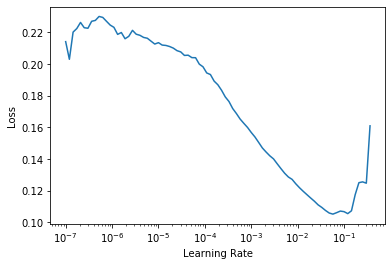
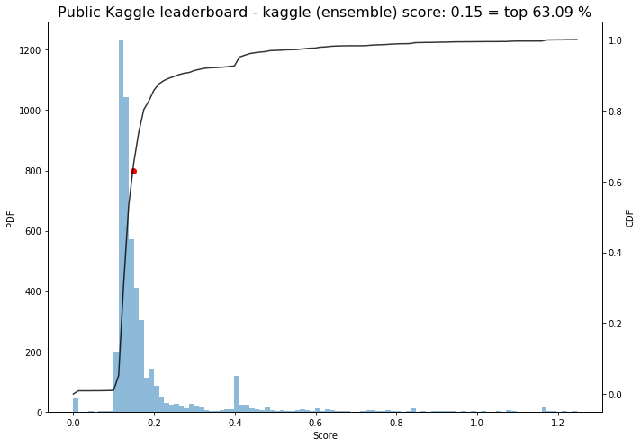
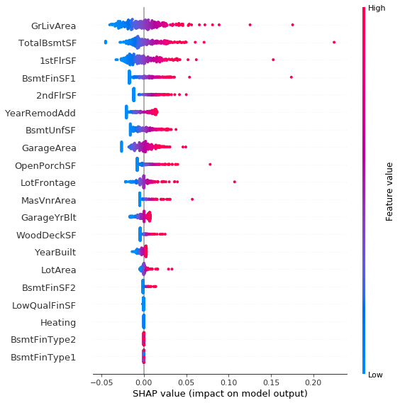

# Kaggle house prices with fastai v2 & nbdev
> This repo purpose is to highlight the [`nbdev` tool](https://github.com/fastai/nbdev) on the kagge house prices data set using the fastai2 package.


## Get leaderboard and competition data

First you will need to collect the train and test data from kaggle. Because it is instructive to visualize where the field is in terms of scores we also download the leaderboard data. The following assumed you have set up a kaggle account. If that's not the case check out this site [here](https://github.com/Kaggle/kaggle-api).

```python
# !kaggle competitions leaderboard {competition} -d -p {dir_leaderboard}
```

```python
# !kaggle competitions download -c {competition} -p {dir_raw_data}
```

```python
# extract_zip_files(compressed_leaderboard_file)
```

```python
# extract_zip_files(compressed_data_file)
```

## Preprocessing

```python
df = pd.read_csv(train_path)
df_test = pd.read_csv(test_path)
```

```python
display_all(df_test.head())
```


<div>
<style scoped>
    .dataframe tbody tr th:only-of-type {
        vertical-align: middle;
    }

    .dataframe tbody tr th {
        vertical-align: top;
    }

    .dataframe thead th {
        text-align: right;
    }
</style>
<table border="1" class="dataframe">
  <thead>
    <tr style="text-align: right;">
      <th></th>
      <th>Id</th>
      <th>MSSubClass</th>
      <th>MSZoning</th>
      <th>LotFrontage</th>
      <th>LotArea</th>
      <th>Street</th>
      <th>Alley</th>
      <th>LotShape</th>
      <th>LandContour</th>
      <th>Utilities</th>
      <th>LotConfig</th>
      <th>LandSlope</th>
      <th>Neighborhood</th>
      <th>Condition1</th>
      <th>Condition2</th>
      <th>BldgType</th>
      <th>HouseStyle</th>
      <th>OverallQual</th>
      <th>OverallCond</th>
      <th>YearBuilt</th>
      <th>YearRemodAdd</th>
      <th>RoofStyle</th>
      <th>RoofMatl</th>
      <th>Exterior1st</th>
      <th>Exterior2nd</th>
      <th>MasVnrType</th>
      <th>MasVnrArea</th>
      <th>ExterQual</th>
      <th>ExterCond</th>
      <th>Foundation</th>
      <th>BsmtQual</th>
      <th>BsmtCond</th>
      <th>BsmtExposure</th>
      <th>BsmtFinType1</th>
      <th>BsmtFinSF1</th>
      <th>BsmtFinType2</th>
      <th>BsmtFinSF2</th>
      <th>BsmtUnfSF</th>
      <th>TotalBsmtSF</th>
      <th>Heating</th>
      <th>HeatingQC</th>
      <th>CentralAir</th>
      <th>Electrical</th>
      <th>1stFlrSF</th>
      <th>2ndFlrSF</th>
      <th>LowQualFinSF</th>
      <th>GrLivArea</th>
      <th>BsmtFullBath</th>
      <th>BsmtHalfBath</th>
      <th>FullBath</th>
      <th>HalfBath</th>
      <th>BedroomAbvGr</th>
      <th>KitchenAbvGr</th>
      <th>KitchenQual</th>
      <th>TotRmsAbvGrd</th>
      <th>Functional</th>
      <th>Fireplaces</th>
      <th>FireplaceQu</th>
      <th>GarageType</th>
      <th>GarageYrBlt</th>
      <th>GarageFinish</th>
      <th>GarageCars</th>
      <th>GarageArea</th>
      <th>GarageQual</th>
      <th>GarageCond</th>
      <th>PavedDrive</th>
      <th>WoodDeckSF</th>
      <th>OpenPorchSF</th>
      <th>EnclosedPorch</th>
      <th>3SsnPorch</th>
      <th>ScreenPorch</th>
      <th>PoolArea</th>
      <th>PoolQC</th>
      <th>Fence</th>
      <th>MiscFeature</th>
      <th>MiscVal</th>
      <th>MoSold</th>
      <th>YrSold</th>
      <th>SaleType</th>
      <th>SaleCondition</th>
    </tr>
  </thead>
  <tbody>
    <tr>
      <th>0</th>
      <td>1461</td>
      <td>20</td>
      <td>RH</td>
      <td>80.0</td>
      <td>11622</td>
      <td>Pave</td>
      <td>NaN</td>
      <td>Reg</td>
      <td>Lvl</td>
      <td>AllPub</td>
      <td>Inside</td>
      <td>Gtl</td>
      <td>NAmes</td>
      <td>Feedr</td>
      <td>Norm</td>
      <td>1Fam</td>
      <td>1Story</td>
      <td>5</td>
      <td>6</td>
      <td>1961</td>
      <td>1961</td>
      <td>Gable</td>
      <td>CompShg</td>
      <td>VinylSd</td>
      <td>VinylSd</td>
      <td>None</td>
      <td>0.0</td>
      <td>TA</td>
      <td>TA</td>
      <td>CBlock</td>
      <td>TA</td>
      <td>TA</td>
      <td>No</td>
      <td>Rec</td>
      <td>468.0</td>
      <td>LwQ</td>
      <td>144.0</td>
      <td>270.0</td>
      <td>882.0</td>
      <td>GasA</td>
      <td>TA</td>
      <td>Y</td>
      <td>SBrkr</td>
      <td>896</td>
      <td>0</td>
      <td>0</td>
      <td>896</td>
      <td>0.0</td>
      <td>0.0</td>
      <td>1</td>
      <td>0</td>
      <td>2</td>
      <td>1</td>
      <td>TA</td>
      <td>5</td>
      <td>Typ</td>
      <td>0</td>
      <td>NaN</td>
      <td>Attchd</td>
      <td>1961.0</td>
      <td>Unf</td>
      <td>1.0</td>
      <td>730.0</td>
      <td>TA</td>
      <td>TA</td>
      <td>Y</td>
      <td>140</td>
      <td>0</td>
      <td>0</td>
      <td>0</td>
      <td>120</td>
      <td>0</td>
      <td>NaN</td>
      <td>MnPrv</td>
      <td>NaN</td>
      <td>0</td>
      <td>6</td>
      <td>2010</td>
      <td>WD</td>
      <td>Normal</td>
    </tr>
    <tr>
      <th>1</th>
      <td>1462</td>
      <td>20</td>
      <td>RL</td>
      <td>81.0</td>
      <td>14267</td>
      <td>Pave</td>
      <td>NaN</td>
      <td>IR1</td>
      <td>Lvl</td>
      <td>AllPub</td>
      <td>Corner</td>
      <td>Gtl</td>
      <td>NAmes</td>
      <td>Norm</td>
      <td>Norm</td>
      <td>1Fam</td>
      <td>1Story</td>
      <td>6</td>
      <td>6</td>
      <td>1958</td>
      <td>1958</td>
      <td>Hip</td>
      <td>CompShg</td>
      <td>Wd Sdng</td>
      <td>Wd Sdng</td>
      <td>BrkFace</td>
      <td>108.0</td>
      <td>TA</td>
      <td>TA</td>
      <td>CBlock</td>
      <td>TA</td>
      <td>TA</td>
      <td>No</td>
      <td>ALQ</td>
      <td>923.0</td>
      <td>Unf</td>
      <td>0.0</td>
      <td>406.0</td>
      <td>1329.0</td>
      <td>GasA</td>
      <td>TA</td>
      <td>Y</td>
      <td>SBrkr</td>
      <td>1329</td>
      <td>0</td>
      <td>0</td>
      <td>1329</td>
      <td>0.0</td>
      <td>0.0</td>
      <td>1</td>
      <td>1</td>
      <td>3</td>
      <td>1</td>
      <td>Gd</td>
      <td>6</td>
      <td>Typ</td>
      <td>0</td>
      <td>NaN</td>
      <td>Attchd</td>
      <td>1958.0</td>
      <td>Unf</td>
      <td>1.0</td>
      <td>312.0</td>
      <td>TA</td>
      <td>TA</td>
      <td>Y</td>
      <td>393</td>
      <td>36</td>
      <td>0</td>
      <td>0</td>
      <td>0</td>
      <td>0</td>
      <td>NaN</td>
      <td>NaN</td>
      <td>Gar2</td>
      <td>12500</td>
      <td>6</td>
      <td>2010</td>
      <td>WD</td>
      <td>Normal</td>
    </tr>
    <tr>
      <th>2</th>
      <td>1463</td>
      <td>60</td>
      <td>RL</td>
      <td>74.0</td>
      <td>13830</td>
      <td>Pave</td>
      <td>NaN</td>
      <td>IR1</td>
      <td>Lvl</td>
      <td>AllPub</td>
      <td>Inside</td>
      <td>Gtl</td>
      <td>Gilbert</td>
      <td>Norm</td>
      <td>Norm</td>
      <td>1Fam</td>
      <td>2Story</td>
      <td>5</td>
      <td>5</td>
      <td>1997</td>
      <td>1998</td>
      <td>Gable</td>
      <td>CompShg</td>
      <td>VinylSd</td>
      <td>VinylSd</td>
      <td>None</td>
      <td>0.0</td>
      <td>TA</td>
      <td>TA</td>
      <td>PConc</td>
      <td>Gd</td>
      <td>TA</td>
      <td>No</td>
      <td>GLQ</td>
      <td>791.0</td>
      <td>Unf</td>
      <td>0.0</td>
      <td>137.0</td>
      <td>928.0</td>
      <td>GasA</td>
      <td>Gd</td>
      <td>Y</td>
      <td>SBrkr</td>
      <td>928</td>
      <td>701</td>
      <td>0</td>
      <td>1629</td>
      <td>0.0</td>
      <td>0.0</td>
      <td>2</td>
      <td>1</td>
      <td>3</td>
      <td>1</td>
      <td>TA</td>
      <td>6</td>
      <td>Typ</td>
      <td>1</td>
      <td>TA</td>
      <td>Attchd</td>
      <td>1997.0</td>
      <td>Fin</td>
      <td>2.0</td>
      <td>482.0</td>
      <td>TA</td>
      <td>TA</td>
      <td>Y</td>
      <td>212</td>
      <td>34</td>
      <td>0</td>
      <td>0</td>
      <td>0</td>
      <td>0</td>
      <td>NaN</td>
      <td>MnPrv</td>
      <td>NaN</td>
      <td>0</td>
      <td>3</td>
      <td>2010</td>
      <td>WD</td>
      <td>Normal</td>
    </tr>
    <tr>
      <th>3</th>
      <td>1464</td>
      <td>60</td>
      <td>RL</td>
      <td>78.0</td>
      <td>9978</td>
      <td>Pave</td>
      <td>NaN</td>
      <td>IR1</td>
      <td>Lvl</td>
      <td>AllPub</td>
      <td>Inside</td>
      <td>Gtl</td>
      <td>Gilbert</td>
      <td>Norm</td>
      <td>Norm</td>
      <td>1Fam</td>
      <td>2Story</td>
      <td>6</td>
      <td>6</td>
      <td>1998</td>
      <td>1998</td>
      <td>Gable</td>
      <td>CompShg</td>
      <td>VinylSd</td>
      <td>VinylSd</td>
      <td>BrkFace</td>
      <td>20.0</td>
      <td>TA</td>
      <td>TA</td>
      <td>PConc</td>
      <td>TA</td>
      <td>TA</td>
      <td>No</td>
      <td>GLQ</td>
      <td>602.0</td>
      <td>Unf</td>
      <td>0.0</td>
      <td>324.0</td>
      <td>926.0</td>
      <td>GasA</td>
      <td>Ex</td>
      <td>Y</td>
      <td>SBrkr</td>
      <td>926</td>
      <td>678</td>
      <td>0</td>
      <td>1604</td>
      <td>0.0</td>
      <td>0.0</td>
      <td>2</td>
      <td>1</td>
      <td>3</td>
      <td>1</td>
      <td>Gd</td>
      <td>7</td>
      <td>Typ</td>
      <td>1</td>
      <td>Gd</td>
      <td>Attchd</td>
      <td>1998.0</td>
      <td>Fin</td>
      <td>2.0</td>
      <td>470.0</td>
      <td>TA</td>
      <td>TA</td>
      <td>Y</td>
      <td>360</td>
      <td>36</td>
      <td>0</td>
      <td>0</td>
      <td>0</td>
      <td>0</td>
      <td>NaN</td>
      <td>NaN</td>
      <td>NaN</td>
      <td>0</td>
      <td>6</td>
      <td>2010</td>
      <td>WD</td>
      <td>Normal</td>
    </tr>
    <tr>
      <th>4</th>
      <td>1465</td>
      <td>120</td>
      <td>RL</td>
      <td>43.0</td>
      <td>5005</td>
      <td>Pave</td>
      <td>NaN</td>
      <td>IR1</td>
      <td>HLS</td>
      <td>AllPub</td>
      <td>Inside</td>
      <td>Gtl</td>
      <td>StoneBr</td>
      <td>Norm</td>
      <td>Norm</td>
      <td>TwnhsE</td>
      <td>1Story</td>
      <td>8</td>
      <td>5</td>
      <td>1992</td>
      <td>1992</td>
      <td>Gable</td>
      <td>CompShg</td>
      <td>HdBoard</td>
      <td>HdBoard</td>
      <td>None</td>
      <td>0.0</td>
      <td>Gd</td>
      <td>TA</td>
      <td>PConc</td>
      <td>Gd</td>
      <td>TA</td>
      <td>No</td>
      <td>ALQ</td>
      <td>263.0</td>
      <td>Unf</td>
      <td>0.0</td>
      <td>1017.0</td>
      <td>1280.0</td>
      <td>GasA</td>
      <td>Ex</td>
      <td>Y</td>
      <td>SBrkr</td>
      <td>1280</td>
      <td>0</td>
      <td>0</td>
      <td>1280</td>
      <td>0.0</td>
      <td>0.0</td>
      <td>2</td>
      <td>0</td>
      <td>2</td>
      <td>1</td>
      <td>Gd</td>
      <td>5</td>
      <td>Typ</td>
      <td>0</td>
      <td>NaN</td>
      <td>Attchd</td>
      <td>1992.0</td>
      <td>RFn</td>
      <td>2.0</td>
      <td>506.0</td>
      <td>TA</td>
      <td>TA</td>
      <td>Y</td>
      <td>0</td>
      <td>82</td>
      <td>0</td>
      <td>0</td>
      <td>144</td>
      <td>0</td>
      <td>NaN</td>
      <td>NaN</td>
      <td>NaN</td>
      <td>0</td>
      <td>1</td>
      <td>2010</td>
      <td>WD</td>
      <td>Normal</td>
    </tr>
  </tbody>
</table>
</div>


```python
show_na_share(df, cont_names)
```

    MasVnrArea: 0.55 %
    GarageYrBlt: 5.55 %
    LotFrontage: 17.74 %


```python
show_na_share(df, cat_names)
```

    Alley: 93.77 %
    MasVnrType: 0.55 %
    BsmtQual: 2.53 %
    BsmtCond: 2.53 %
    BsmtExposure: 2.60 %
    BsmtFinType1: 2.53 %
    BsmtFinType2: 2.60 %
    Electrical: 0.07 %
    FireplaceQu: 47.26 %
    GarageType: 5.55 %
    GarageFinish: 5.55 %
    GarageQual: 5.55 %
    GarageCond: 5.55 %
    PoolQC: 99.52 %
    Fence: 80.75 %
    MiscFeature: 96.30 %


```python
val_col = "is_valid"
df = get_split(df, valid_pct=.2, val_col=val_col)
display(df[val_col].value_counts())
```


    False    1168
    True      292
    Name: is_valid, dtype: int64


```python
df[dep_var] = df[dep_var].apply(np.log)
```

Anticipating columns with missing values

```python
%%time
cont_fill_vals = {col: np.nanmedian(df.loc[df[val_col]==False, col]) for col in cont_names}
cont_fill_vals
```

    CPU times: user 11.2 ms, sys: 0 ns, total: 11.2 ms
    Wall time: 12.1 ms


    {'LotArea': 9423.0,
     'YearBuilt': 1973.0,
     'YearRemodAdd': 1994.0,
     'MasVnrArea': 0.0,
     'BsmtFinSF2': 0.0,
     'BsmtUnfSF': 469.0,
     'TotalBsmtSF': 1002.5,
     '1stFlrSF': 1086.0,
     '2ndFlrSF': 0.0,
     'GrLivArea': 1456.0,
     'GarageYrBlt': 1980.0,
     'GarageArea': 478.0,
     'WoodDeckSF': 0.0,
     'OpenPorchSF': 24.0,
     'LotFrontage': 70.0,
     'BsmtFinSF1': 384.0,
     'LowQualFinSF': 0.0}


Defining fastai2's internal transforms

```python
procs = [Categorify, FillMissing, Normalize]
```

Providing training/validation split info using the `val_col` added to `df` above using `get_split`

```python
splits = ColSplitter(col=val_col)(df)
```

Substituting potential unexpected nans in the valdiation set

```python
ix_train = df[val_col]==False
df.loc[~ix_train,:] = deal_with_continuous_nans(df.loc[ix_train,:], df.loc[~ix_train,:], 
                                                cont_names, cont_fill_vals)
```

Initializing a `TabularPandas` object to transform and feed data to the learner

```python
to = TabularPandas(df, procs=procs, cat_names=list(cat_names), cont_names=list(cont_names),
                   y_names=dep_var, splits=splits)
```

```python
display_all(df.iloc[splits[1]][cat_names].head())
```


<div>
<style scoped>
    .dataframe tbody tr th:only-of-type {
        vertical-align: middle;
    }

    .dataframe tbody tr th {
        vertical-align: top;
    }

    .dataframe thead th {
        text-align: right;
    }
</style>
<table border="1" class="dataframe">
  <thead>
    <tr style="text-align: right;">
      <th></th>
      <th>Id</th>
      <th>MSSubClass</th>
      <th>MSZoning</th>
      <th>Street</th>
      <th>Alley</th>
      <th>LotShape</th>
      <th>LandContour</th>
      <th>Utilities</th>
      <th>LotConfig</th>
      <th>LandSlope</th>
      <th>Neighborhood</th>
      <th>Condition1</th>
      <th>Condition2</th>
      <th>BldgType</th>
      <th>HouseStyle</th>
      <th>OverallQual</th>
      <th>OverallCond</th>
      <th>RoofStyle</th>
      <th>RoofMatl</th>
      <th>Exterior1st</th>
      <th>Exterior2nd</th>
      <th>MasVnrType</th>
      <th>ExterQual</th>
      <th>ExterCond</th>
      <th>Foundation</th>
      <th>BsmtQual</th>
      <th>BsmtCond</th>
      <th>BsmtExposure</th>
      <th>BsmtFinType1</th>
      <th>BsmtFinType2</th>
      <th>Heating</th>
      <th>HeatingQC</th>
      <th>CentralAir</th>
      <th>Electrical</th>
      <th>BsmtFullBath</th>
      <th>BsmtHalfBath</th>
      <th>FullBath</th>
      <th>HalfBath</th>
      <th>BedroomAbvGr</th>
      <th>KitchenAbvGr</th>
      <th>KitchenQual</th>
      <th>TotRmsAbvGrd</th>
      <th>Functional</th>
      <th>Fireplaces</th>
      <th>FireplaceQu</th>
      <th>GarageType</th>
      <th>GarageFinish</th>
      <th>GarageCars</th>
      <th>GarageQual</th>
      <th>GarageCond</th>
      <th>PavedDrive</th>
      <th>EnclosedPorch</th>
      <th>3SsnPorch</th>
      <th>ScreenPorch</th>
      <th>PoolArea</th>
      <th>PoolQC</th>
      <th>Fence</th>
      <th>MiscFeature</th>
      <th>MiscVal</th>
      <th>MoSold</th>
      <th>SaleType</th>
      <th>SaleCondition</th>
    </tr>
  </thead>
  <tbody>
    <tr>
      <th>1168</th>
      <td>1169</td>
      <td>70</td>
      <td>RL</td>
      <td>Pave</td>
      <td>NaN</td>
      <td>Reg</td>
      <td>Lvl</td>
      <td>AllPub</td>
      <td>Corner</td>
      <td>Gtl</td>
      <td>Edwards</td>
      <td>Norm</td>
      <td>Norm</td>
      <td>1Fam</td>
      <td>2Story</td>
      <td>6</td>
      <td>7</td>
      <td>Hip</td>
      <td>CompShg</td>
      <td>Stucco</td>
      <td>Stucco</td>
      <td>None</td>
      <td>TA</td>
      <td>TA</td>
      <td>CBlock</td>
      <td>TA</td>
      <td>TA</td>
      <td>No</td>
      <td>Rec</td>
      <td>Unf</td>
      <td>GasA</td>
      <td>Ex</td>
      <td>Y</td>
      <td>SBrkr</td>
      <td>0</td>
      <td>0</td>
      <td>2</td>
      <td>0</td>
      <td>4</td>
      <td>1</td>
      <td>Gd</td>
      <td>7</td>
      <td>Typ</td>
      <td>2</td>
      <td>TA</td>
      <td>Basment</td>
      <td>Unf</td>
      <td>2</td>
      <td>TA</td>
      <td>TA</td>
      <td>Y</td>
      <td>0</td>
      <td>0</td>
      <td>90</td>
      <td>0</td>
      <td>NaN</td>
      <td>NaN</td>
      <td>NaN</td>
      <td>0</td>
      <td>7</td>
      <td>WD</td>
      <td>Normal</td>
    </tr>
    <tr>
      <th>1169</th>
      <td>1170</td>
      <td>60</td>
      <td>RL</td>
      <td>Pave</td>
      <td>NaN</td>
      <td>IR1</td>
      <td>Lvl</td>
      <td>AllPub</td>
      <td>CulDSac</td>
      <td>Gtl</td>
      <td>NoRidge</td>
      <td>Norm</td>
      <td>Norm</td>
      <td>1Fam</td>
      <td>2Story</td>
      <td>10</td>
      <td>5</td>
      <td>Hip</td>
      <td>CompShg</td>
      <td>HdBoard</td>
      <td>HdBoard</td>
      <td>BrkFace</td>
      <td>Gd</td>
      <td>Gd</td>
      <td>PConc</td>
      <td>Ex</td>
      <td>TA</td>
      <td>Gd</td>
      <td>GLQ</td>
      <td>Unf</td>
      <td>GasA</td>
      <td>Ex</td>
      <td>Y</td>
      <td>SBrkr</td>
      <td>1</td>
      <td>0</td>
      <td>3</td>
      <td>1</td>
      <td>4</td>
      <td>1</td>
      <td>Gd</td>
      <td>10</td>
      <td>Typ</td>
      <td>1</td>
      <td>TA</td>
      <td>Attchd</td>
      <td>Fin</td>
      <td>3</td>
      <td>TA</td>
      <td>TA</td>
      <td>Y</td>
      <td>0</td>
      <td>0</td>
      <td>0</td>
      <td>0</td>
      <td>NaN</td>
      <td>NaN</td>
      <td>NaN</td>
      <td>0</td>
      <td>7</td>
      <td>WD</td>
      <td>Normal</td>
    </tr>
    <tr>
      <th>1170</th>
      <td>1171</td>
      <td>80</td>
      <td>RL</td>
      <td>Pave</td>
      <td>NaN</td>
      <td>Reg</td>
      <td>Lvl</td>
      <td>AllPub</td>
      <td>Inside</td>
      <td>Gtl</td>
      <td>Mitchel</td>
      <td>Norm</td>
      <td>Norm</td>
      <td>1Fam</td>
      <td>SLvl</td>
      <td>6</td>
      <td>6</td>
      <td>Gable</td>
      <td>CompShg</td>
      <td>Plywood</td>
      <td>Plywood</td>
      <td>None</td>
      <td>TA</td>
      <td>TA</td>
      <td>CBlock</td>
      <td>TA</td>
      <td>TA</td>
      <td>Av</td>
      <td>ALQ</td>
      <td>Unf</td>
      <td>GasA</td>
      <td>TA</td>
      <td>Y</td>
      <td>SBrkr</td>
      <td>1</td>
      <td>0</td>
      <td>1</td>
      <td>0</td>
      <td>3</td>
      <td>1</td>
      <td>TA</td>
      <td>6</td>
      <td>Typ</td>
      <td>1</td>
      <td>Po</td>
      <td>Attchd</td>
      <td>Fin</td>
      <td>1</td>
      <td>TA</td>
      <td>TA</td>
      <td>Y</td>
      <td>0</td>
      <td>0</td>
      <td>0</td>
      <td>576</td>
      <td>Gd</td>
      <td>GdPrv</td>
      <td>NaN</td>
      <td>0</td>
      <td>7</td>
      <td>WD</td>
      <td>Normal</td>
    </tr>
    <tr>
      <th>1171</th>
      <td>1172</td>
      <td>20</td>
      <td>RL</td>
      <td>Pave</td>
      <td>NaN</td>
      <td>Reg</td>
      <td>Lvl</td>
      <td>AllPub</td>
      <td>Inside</td>
      <td>Gtl</td>
      <td>NAmes</td>
      <td>Norm</td>
      <td>Norm</td>
      <td>1Fam</td>
      <td>1Story</td>
      <td>6</td>
      <td>6</td>
      <td>Hip</td>
      <td>CompShg</td>
      <td>MetalSd</td>
      <td>MetalSd</td>
      <td>None</td>
      <td>TA</td>
      <td>TA</td>
      <td>CBlock</td>
      <td>TA</td>
      <td>TA</td>
      <td>No</td>
      <td>ALQ</td>
      <td>Unf</td>
      <td>GasA</td>
      <td>Ex</td>
      <td>Y</td>
      <td>SBrkr</td>
      <td>1</td>
      <td>0</td>
      <td>1</td>
      <td>0</td>
      <td>3</td>
      <td>1</td>
      <td>TA</td>
      <td>6</td>
      <td>Typ</td>
      <td>1</td>
      <td>TA</td>
      <td>Attchd</td>
      <td>RFn</td>
      <td>2</td>
      <td>TA</td>
      <td>TA</td>
      <td>Y</td>
      <td>0</td>
      <td>0</td>
      <td>288</td>
      <td>0</td>
      <td>NaN</td>
      <td>NaN</td>
      <td>Shed</td>
      <td>1400</td>
      <td>11</td>
      <td>WD</td>
      <td>Normal</td>
    </tr>
    <tr>
      <th>1172</th>
      <td>1173</td>
      <td>160</td>
      <td>FV</td>
      <td>Pave</td>
      <td>Pave</td>
      <td>IR1</td>
      <td>Lvl</td>
      <td>AllPub</td>
      <td>Inside</td>
      <td>Gtl</td>
      <td>Somerst</td>
      <td>Norm</td>
      <td>Norm</td>
      <td>TwnhsE</td>
      <td>2Story</td>
      <td>7</td>
      <td>5</td>
      <td>Gable</td>
      <td>CompShg</td>
      <td>MetalSd</td>
      <td>MetalSd</td>
      <td>None</td>
      <td>Gd</td>
      <td>TA</td>
      <td>PConc</td>
      <td>Gd</td>
      <td>TA</td>
      <td>No</td>
      <td>Unf</td>
      <td>Unf</td>
      <td>GasA</td>
      <td>Ex</td>
      <td>Y</td>
      <td>SBrkr</td>
      <td>0</td>
      <td>0</td>
      <td>2</td>
      <td>1</td>
      <td>2</td>
      <td>1</td>
      <td>Gd</td>
      <td>5</td>
      <td>Typ</td>
      <td>0</td>
      <td>NaN</td>
      <td>Detchd</td>
      <td>Fin</td>
      <td>2</td>
      <td>TA</td>
      <td>TA</td>
      <td>Y</td>
      <td>0</td>
      <td>0</td>
      <td>0</td>
      <td>0</td>
      <td>NaN</td>
      <td>NaN</td>
      <td>NaN</td>
      <td>0</td>
      <td>3</td>
      <td>WD</td>
      <td>Normal</td>
    </tr>
  </tbody>
</table>
</div>


```python
display_all(to.valid.xs[cat_names].head())
```


<div>
<style scoped>
    .dataframe tbody tr th:only-of-type {
        vertical-align: middle;
    }

    .dataframe tbody tr th {
        vertical-align: top;
    }

    .dataframe thead th {
        text-align: right;
    }
</style>
<table border="1" class="dataframe">
  <thead>
    <tr style="text-align: right;">
      <th></th>
      <th>Id</th>
      <th>MSSubClass</th>
      <th>MSZoning</th>
      <th>Street</th>
      <th>Alley</th>
      <th>LotShape</th>
      <th>LandContour</th>
      <th>Utilities</th>
      <th>LotConfig</th>
      <th>LandSlope</th>
      <th>Neighborhood</th>
      <th>Condition1</th>
      <th>Condition2</th>
      <th>BldgType</th>
      <th>HouseStyle</th>
      <th>OverallQual</th>
      <th>OverallCond</th>
      <th>RoofStyle</th>
      <th>RoofMatl</th>
      <th>Exterior1st</th>
      <th>Exterior2nd</th>
      <th>MasVnrType</th>
      <th>ExterQual</th>
      <th>ExterCond</th>
      <th>Foundation</th>
      <th>BsmtQual</th>
      <th>BsmtCond</th>
      <th>BsmtExposure</th>
      <th>BsmtFinType1</th>
      <th>BsmtFinType2</th>
      <th>Heating</th>
      <th>HeatingQC</th>
      <th>CentralAir</th>
      <th>Electrical</th>
      <th>BsmtFullBath</th>
      <th>BsmtHalfBath</th>
      <th>FullBath</th>
      <th>HalfBath</th>
      <th>BedroomAbvGr</th>
      <th>KitchenAbvGr</th>
      <th>KitchenQual</th>
      <th>TotRmsAbvGrd</th>
      <th>Functional</th>
      <th>Fireplaces</th>
      <th>FireplaceQu</th>
      <th>GarageType</th>
      <th>GarageFinish</th>
      <th>GarageCars</th>
      <th>GarageQual</th>
      <th>GarageCond</th>
      <th>PavedDrive</th>
      <th>EnclosedPorch</th>
      <th>3SsnPorch</th>
      <th>ScreenPorch</th>
      <th>PoolArea</th>
      <th>PoolQC</th>
      <th>Fence</th>
      <th>MiscFeature</th>
      <th>MiscVal</th>
      <th>MoSold</th>
      <th>SaleType</th>
      <th>SaleCondition</th>
    </tr>
  </thead>
  <tbody>
    <tr>
      <th>1168</th>
      <td>0</td>
      <td>7</td>
      <td>4</td>
      <td>2</td>
      <td>0</td>
      <td>4</td>
      <td>4</td>
      <td>1</td>
      <td>1</td>
      <td>1</td>
      <td>8</td>
      <td>3</td>
      <td>3</td>
      <td>1</td>
      <td>6</td>
      <td>6</td>
      <td>7</td>
      <td>4</td>
      <td>1</td>
      <td>10</td>
      <td>12</td>
      <td>3</td>
      <td>4</td>
      <td>5</td>
      <td>2</td>
      <td>4</td>
      <td>4</td>
      <td>4</td>
      <td>5</td>
      <td>6</td>
      <td>1</td>
      <td>1</td>
      <td>2</td>
      <td>5</td>
      <td>1</td>
      <td>1</td>
      <td>3</td>
      <td>1</td>
      <td>5</td>
      <td>2</td>
      <td>3</td>
      <td>6</td>
      <td>7</td>
      <td>3</td>
      <td>5</td>
      <td>3</td>
      <td>3</td>
      <td>3</td>
      <td>5</td>
      <td>5</td>
      <td>3</td>
      <td>1</td>
      <td>1</td>
      <td>5</td>
      <td>1</td>
      <td>0</td>
      <td>0</td>
      <td>0</td>
      <td>1</td>
      <td>7</td>
      <td>9</td>
      <td>5</td>
    </tr>
    <tr>
      <th>1169</th>
      <td>0</td>
      <td>6</td>
      <td>4</td>
      <td>2</td>
      <td>0</td>
      <td>1</td>
      <td>4</td>
      <td>1</td>
      <td>2</td>
      <td>1</td>
      <td>16</td>
      <td>3</td>
      <td>3</td>
      <td>1</td>
      <td>6</td>
      <td>10</td>
      <td>5</td>
      <td>4</td>
      <td>1</td>
      <td>6</td>
      <td>6</td>
      <td>2</td>
      <td>3</td>
      <td>3</td>
      <td>3</td>
      <td>1</td>
      <td>4</td>
      <td>2</td>
      <td>3</td>
      <td>6</td>
      <td>1</td>
      <td>1</td>
      <td>2</td>
      <td>5</td>
      <td>2</td>
      <td>1</td>
      <td>4</td>
      <td>2</td>
      <td>5</td>
      <td>2</td>
      <td>3</td>
      <td>9</td>
      <td>7</td>
      <td>2</td>
      <td>5</td>
      <td>2</td>
      <td>1</td>
      <td>4</td>
      <td>5</td>
      <td>5</td>
      <td>3</td>
      <td>1</td>
      <td>1</td>
      <td>1</td>
      <td>1</td>
      <td>0</td>
      <td>0</td>
      <td>0</td>
      <td>1</td>
      <td>7</td>
      <td>9</td>
      <td>5</td>
    </tr>
    <tr>
      <th>1170</th>
      <td>0</td>
      <td>9</td>
      <td>4</td>
      <td>2</td>
      <td>0</td>
      <td>4</td>
      <td>4</td>
      <td>1</td>
      <td>5</td>
      <td>1</td>
      <td>12</td>
      <td>3</td>
      <td>3</td>
      <td>1</td>
      <td>8</td>
      <td>6</td>
      <td>6</td>
      <td>2</td>
      <td>1</td>
      <td>8</td>
      <td>10</td>
      <td>3</td>
      <td>4</td>
      <td>5</td>
      <td>2</td>
      <td>4</td>
      <td>4</td>
      <td>1</td>
      <td>1</td>
      <td>6</td>
      <td>1</td>
      <td>5</td>
      <td>2</td>
      <td>5</td>
      <td>2</td>
      <td>1</td>
      <td>2</td>
      <td>1</td>
      <td>4</td>
      <td>2</td>
      <td>4</td>
      <td>5</td>
      <td>7</td>
      <td>2</td>
      <td>4</td>
      <td>2</td>
      <td>1</td>
      <td>2</td>
      <td>5</td>
      <td>5</td>
      <td>3</td>
      <td>1</td>
      <td>1</td>
      <td>1</td>
      <td>0</td>
      <td>0</td>
      <td>1</td>
      <td>0</td>
      <td>1</td>
      <td>7</td>
      <td>9</td>
      <td>5</td>
    </tr>
    <tr>
      <th>1171</th>
      <td>0</td>
      <td>1</td>
      <td>4</td>
      <td>2</td>
      <td>0</td>
      <td>4</td>
      <td>4</td>
      <td>1</td>
      <td>5</td>
      <td>1</td>
      <td>13</td>
      <td>3</td>
      <td>3</td>
      <td>1</td>
      <td>3</td>
      <td>6</td>
      <td>6</td>
      <td>4</td>
      <td>1</td>
      <td>7</td>
      <td>8</td>
      <td>3</td>
      <td>4</td>
      <td>5</td>
      <td>2</td>
      <td>4</td>
      <td>4</td>
      <td>4</td>
      <td>1</td>
      <td>6</td>
      <td>1</td>
      <td>1</td>
      <td>2</td>
      <td>5</td>
      <td>2</td>
      <td>1</td>
      <td>2</td>
      <td>1</td>
      <td>4</td>
      <td>2</td>
      <td>4</td>
      <td>5</td>
      <td>7</td>
      <td>2</td>
      <td>5</td>
      <td>2</td>
      <td>2</td>
      <td>3</td>
      <td>5</td>
      <td>5</td>
      <td>3</td>
      <td>1</td>
      <td>1</td>
      <td>0</td>
      <td>1</td>
      <td>0</td>
      <td>0</td>
      <td>3</td>
      <td>0</td>
      <td>11</td>
      <td>9</td>
      <td>5</td>
    </tr>
    <tr>
      <th>1172</th>
      <td>0</td>
      <td>13</td>
      <td>2</td>
      <td>2</td>
      <td>2</td>
      <td>1</td>
      <td>4</td>
      <td>1</td>
      <td>5</td>
      <td>1</td>
      <td>22</td>
      <td>3</td>
      <td>3</td>
      <td>5</td>
      <td>6</td>
      <td>7</td>
      <td>5</td>
      <td>2</td>
      <td>1</td>
      <td>7</td>
      <td>8</td>
      <td>3</td>
      <td>3</td>
      <td>5</td>
      <td>3</td>
      <td>3</td>
      <td>4</td>
      <td>4</td>
      <td>6</td>
      <td>6</td>
      <td>1</td>
      <td>1</td>
      <td>2</td>
      <td>5</td>
      <td>1</td>
      <td>1</td>
      <td>3</td>
      <td>2</td>
      <td>3</td>
      <td>2</td>
      <td>3</td>
      <td>4</td>
      <td>7</td>
      <td>1</td>
      <td>0</td>
      <td>6</td>
      <td>1</td>
      <td>3</td>
      <td>5</td>
      <td>5</td>
      <td>3</td>
      <td>1</td>
      <td>1</td>
      <td>1</td>
      <td>1</td>
      <td>0</td>
      <td>0</td>
      <td>0</td>
      <td>1</td>
      <td>3</td>
      <td>9</td>
      <td>5</td>
    </tr>
  </tbody>
</table>
</div>


Generating training and validation data loaders for the model development

```python
dls = to.dataloaders()
```

## Fitting a deep net model using `TabularLearner`

Defining the loss function

```python
loss_fun = torch.nn.functional.mse_loss
```

This step, defining `y_range`, is probably optional because in principle, given enough iterations, the model will predict `dep_var` in the correct range. But it is just a lot faster when using `y_range`.

```python
y_range = [min(to.valid.ys.values.min(), to.train.ys.values.min()), 
           max(to.valid.ys.values.max(), to.train.ys.values.max())]; y_range
```


[10.460242108190519, 13.534473028231162]


Instantiating the learner using a `TabularModel` class where the `__init__` method was altered to allow other activation functions, e.g. `modelling.Mish`, to be used in the model than the default ReLu. See `kaggle_house_prices.modelling` or `02_modelling.ipynb` for details.

```python
%%time
learn = tabular_learner(dls, n_out=1, loss_func=loss_fun, config=dict(active_fun=Mish),
                        y_range=y_range)
```

    CPU times: user 17.9 ms, sys: 1.32 ms, total: 19.2 ms
    Wall time: 405 ms


Looking for `max_lr`

```python
%%time
learn.lr_find()
```


    CPU times: user 3.22 s, sys: 40.1 ms, total: 3.26 s
    Wall time: 4.13 s


    (0.004786301031708717, 3.6307804407442745e-07)





Training using the [one-cycle policy](https://arxiv.org/abs/1708.07120)

```python
%%time
learn.fit_one_cycle(5, 1e-3)
```


<table border="1" class="dataframe">
  <thead>
    <tr style="text-align: left;">
      <th>epoch</th>
      <th>train_loss</th>
      <th>valid_loss</th>
      <th>time</th>
    </tr>
  </thead>
  <tbody>
    <tr>
      <td>0</td>
      <td>0.111663</td>
      <td>0.119455</td>
      <td>00:00</td>
    </tr>
    <tr>
      <td>1</td>
      <td>0.059973</td>
      <td>0.096834</td>
      <td>00:00</td>
    </tr>
    <tr>
      <td>2</td>
      <td>0.037966</td>
      <td>0.082006</td>
      <td>00:00</td>
    </tr>
    <tr>
      <td>3</td>
      <td>0.025313</td>
      <td>0.060234</td>
      <td>00:00</td>
    </tr>
    <tr>
      <td>4</td>
      <td>0.017952</td>
      <td>0.037233</td>
      <td>00:00</td>
    </tr>
  </tbody>
</table>


    CPU times: user 3.66 s, sys: 20.3 ms, total: 3.68 s
    Wall time: 3.87 s


## Gauging model quality of the tabular learner

Making predictions over the validation set

```python
y_pred, y_true = learn.get_preds()

y_pred[:5], y_true[:5]
```


    (tensor([[12.0984],
             [12.8230],
             [11.8075],
             [11.9257],
             [11.8775]]),
     tensor([[12.3673],
             [13.3455],
             [12.0494],
             [12.0015],
             [12.0547]]))


Comparing the score to the leader board (does not replace submitting the predictions over the test set)

```python
my_score = loss_fun(y_pred, y_true).item()

show_leaderboard(fname_leaderboard, score_bounds=(None, 1.25), bins=100, user_score=my_score, user="my")
```


<div>
<style scoped>
    .dataframe tbody tr th:only-of-type {
        vertical-align: middle;
    }

    .dataframe tbody tr th {
        vertical-align: top;
    }

    .dataframe thead th {
        text-align: right;
    }
</style>
<table border="1" class="dataframe">
  <thead>
    <tr style="text-align: right;">
      <th></th>
      <th>TeamId</th>
      <th>TeamName</th>
      <th>SubmissionDate</th>
      <th>Score</th>
    </tr>
  </thead>
  <tbody>
    <tr>
      <th>7590</th>
      <td>4210573</td>
      <td>hsuanpingsun</td>
      <td>2020-01-04 03:44:55</td>
      <td>0.0</td>
    </tr>
    <tr>
      <th>10044</th>
      <td>4278029</td>
      <td>Muhammet İkbal Elek</td>
      <td>2020-01-20 13:09:34</td>
      <td>0.0</td>
    </tr>
    <tr>
      <th>9856</th>
      <td>3740535</td>
      <td>wentixiaogege</td>
      <td>2020-01-19 03:37:57</td>
      <td>0.0</td>
    </tr>
    <tr>
      <th>4988</th>
      <td>4155989</td>
      <td>terracoda</td>
      <td>2019-12-20 12:56:53</td>
      <td>0.0</td>
    </tr>
    <tr>
      <th>15086</th>
      <td>2248598</td>
      <td>predictor!</td>
      <td>2020-02-15 13:51:49</td>
      <td>0.0</td>
    </tr>
  </tbody>
</table>
</div>


Computing SHAP values for later inspection of the model. Because of the pytorch model is set up with fastai2's `TabularModel` one cannot directly pass it to the `shap.DeepExplainer`, rather one needs to wrap it using `inspection.FastaiModel`

```python
model = FastaiModel(learn, to)
```

```python
%%time
X = torch.from_numpy(to.valid.xs.values)
explainer = shap.DeepExplainer(model, X)
shap_values = explainer.shap_values(X)
```

    CPU times: user 13.2 s, sys: 678 ms, total: 13.9 s
    Wall time: 14 s


## Fitting an ensemble model - `RandomForestRegressor`

Yup

```python
ens = ensemble.RandomForestRegressor(n_estimators=100, max_features="sqrt", max_samples=.9, oob_score=True)
```

```python
%%time
ens.fit(to.train.xs.values, to.train.ys.values.ravel())
```

    CPU times: user 416 ms, sys: 0 ns, total: 416 ms
    Wall time: 416 ms


    RandomForestRegressor(bootstrap=True, ccp_alpha=0.0, criterion='mse',
                          max_depth=None, max_features='sqrt', max_leaf_nodes=None,
                          max_samples=0.9, min_impurity_decrease=0.0,
                          min_impurity_split=None, min_samples_leaf=1,
                          min_samples_split=2, min_weight_fraction_leaf=0.0,
                          n_estimators=100, n_jobs=None, oob_score=True,
                          random_state=None, verbose=0, warm_start=False)


```python
%%time
y_pred_ens = ens.predict(to.valid.xs.values)
```

    CPU times: user 12.1 ms, sys: 4.01 ms, total: 16.1 ms
    Wall time: 16.5 ms


```python
my_score_ens = loss_fun(torch.from_numpy(y_pred_ens[:,None]).float(), y_true).item()

show_leaderboard(fname_leaderboard, score_bounds=(None, 1.25), bins=100, user_score=my_score_ens, 
                 user="my (ensemble)")
```


<div>
<style scoped>
    .dataframe tbody tr th:only-of-type {
        vertical-align: middle;
    }

    .dataframe tbody tr th {
        vertical-align: top;
    }

    .dataframe thead th {
        text-align: right;
    }
</style>
<table border="1" class="dataframe">
  <thead>
    <tr style="text-align: right;">
      <th></th>
      <th>TeamId</th>
      <th>TeamName</th>
      <th>SubmissionDate</th>
      <th>Score</th>
    </tr>
  </thead>
  <tbody>
    <tr>
      <th>7590</th>
      <td>4210573</td>
      <td>hsuanpingsun</td>
      <td>2020-01-04 03:44:55</td>
      <td>0.0</td>
    </tr>
    <tr>
      <th>10044</th>
      <td>4278029</td>
      <td>Muhammet İkbal Elek</td>
      <td>2020-01-20 13:09:34</td>
      <td>0.0</td>
    </tr>
    <tr>
      <th>9856</th>
      <td>3740535</td>
      <td>wentixiaogege</td>
      <td>2020-01-19 03:37:57</td>
      <td>0.0</td>
    </tr>
    <tr>
      <th>4988</th>
      <td>4155989</td>
      <td>terracoda</td>
      <td>2019-12-20 12:56:53</td>
      <td>0.0</td>
    </tr>
    <tr>
      <th>15086</th>
      <td>2248598</td>
      <td>predictor!</td>
      <td>2020-02-15 13:51:49</td>
      <td>0.0</td>
    </tr>
  </tbody>
</table>
</div>





Computing SHAP values for the ensemble model

```python
%%time
_X = X.detach().numpy()
ens_explainer = shap.TreeExplainer(ens, _X)
ens_shap_values = ens_explainer.shap_values(_X)
```

     99%|===================| 290/292 [00:40<00:00]        

    CPU times: user 39.4 s, sys: 102 ms, total: 39.5 s
    Wall time: 39.7 s


## SHAP summary plots

The [`shap`](https://github.com/slundberg/shap) package can be used to inspect how neural net and tree based arrive at their prediction. The SHAP paper can be found [here](https://papers.nips.cc/paper/7062-a-unified-approach-to-interpreting-model-predictions). Using `shap.summary_plot` one can gauge the order in which features are relevant for model predictions and how they generally contribute, increasing or decreasing the predicted values.

Inspecting the fastai's tabular model

```python
shap.summary_plot(shap_values, to.valid.xs)
```





Inspecting the ensemble model

```python
shap.summary_plot(ens_shap_values, to.valid.xs)
```


## Making predictions over unseen data

To actually use the trained models we need to predict over unseen data, here contained in `df_test`. To do this we first  need to deal with any unexpected nan values.

```python
df_test = deal_with_continuous_nans(df.loc[ix_train,:], df_test, cont_names, cont_fill_vals)
```

### Predictions using `TabularModel`

Creating `dl` for `learn.get_preds`

```python
dl = learn.dls.test_dl(df_test)
```

Making predictions

```python
res = learn.get_preds(dl=dl)
```


```python
res
```


    (tensor([[11.7512],
             [11.9980],
             [12.1427],
             ...,
             [12.0335],
             [11.7913],
             [12.2374]]),
     None)


```python
preds = np.exp(res[0].detach().numpy()); preds
```


    array([[126903.9 ],
           [162426.06],
           [187725.38],
           ...,
           [168300.19],
           [132091.77],
           [206372.11]], dtype=float32)


```python
preds = pd.DataFrame({"Id": df_test["Id"], "SalePrice":preds.ravel()}); preds.head()
```


<div>
<style scoped>
    .dataframe tbody tr th:only-of-type {
        vertical-align: middle;
    }

    .dataframe tbody tr th {
        vertical-align: top;
    }

    .dataframe thead th {
        text-align: right;
    }
</style>
<table border="1" class="dataframe">
  <thead>
    <tr style="text-align: right;">
      <th></th>
      <th>Id</th>
      <th>SalePrice</th>
    </tr>
  </thead>
  <tbody>
    <tr>
      <th>0</th>
      <td>1461</td>
      <td>126903.898438</td>
    </tr>
    <tr>
      <th>1</th>
      <td>1462</td>
      <td>162426.062500</td>
    </tr>
    <tr>
      <th>2</th>
      <td>1463</td>
      <td>187725.375000</td>
    </tr>
    <tr>
      <th>3</th>
      <td>1464</td>
      <td>198973.656250</td>
    </tr>
    <tr>
      <th>4</th>
      <td>1465</td>
      <td>180530.468750</td>
    </tr>
  </tbody>
</table>
</div>


```python
preds.to_csv("../data/submission_tm.csv", index=False)
```

### Predictions using the ensemble model

```python
dl.xs.head()
```


<div>
<style scoped>
    .dataframe tbody tr th:only-of-type {
        vertical-align: middle;
    }

    .dataframe tbody tr th {
        vertical-align: top;
    }

    .dataframe thead th {
        text-align: right;
    }
</style>
<table border="1" class="dataframe">
  <thead>
    <tr style="text-align: right;">
      <th></th>
      <th>Id</th>
      <th>MSSubClass</th>
      <th>MSZoning</th>
      <th>Street</th>
      <th>Alley</th>
      <th>LotShape</th>
      <th>LandContour</th>
      <th>Utilities</th>
      <th>LotConfig</th>
      <th>LandSlope</th>
      <th>...</th>
      <th>1stFlrSF</th>
      <th>2ndFlrSF</th>
      <th>GrLivArea</th>
      <th>GarageYrBlt</th>
      <th>GarageArea</th>
      <th>WoodDeckSF</th>
      <th>OpenPorchSF</th>
      <th>LotFrontage</th>
      <th>BsmtFinSF1</th>
      <th>LowQualFinSF</th>
    </tr>
  </thead>
  <tbody>
    <tr>
      <th>0</th>
      <td>0</td>
      <td>1</td>
      <td>3</td>
      <td>2</td>
      <td>0</td>
      <td>4</td>
      <td>4</td>
      <td>1</td>
      <td>5</td>
      <td>1</td>
      <td>...</td>
      <td>-0.696760</td>
      <td>-0.784944</td>
      <td>-1.196857</td>
      <td>-0.734762</td>
      <td>1.223488</td>
      <td>0.367464</td>
      <td>-0.703697</td>
      <td>0.471615</td>
      <td>0.059819</td>
      <td>-0.124196</td>
    </tr>
    <tr>
      <th>1</th>
      <td>0</td>
      <td>1</td>
      <td>4</td>
      <td>2</td>
      <td>0</td>
      <td>1</td>
      <td>4</td>
      <td>1</td>
      <td>1</td>
      <td>1</td>
      <td>...</td>
      <td>0.462171</td>
      <td>-0.784944</td>
      <td>-0.341786</td>
      <td>-0.860096</td>
      <td>-0.759950</td>
      <td>2.415426</td>
      <td>-0.154205</td>
      <td>0.518572</td>
      <td>1.103552</td>
      <td>-0.124196</td>
    </tr>
    <tr>
      <th>2</th>
      <td>0</td>
      <td>6</td>
      <td>4</td>
      <td>2</td>
      <td>0</td>
      <td>1</td>
      <td>4</td>
      <td>1</td>
      <td>5</td>
      <td>1</td>
      <td>...</td>
      <td>-0.611111</td>
      <td>0.836141</td>
      <td>0.250642</td>
      <td>0.769243</td>
      <td>0.046711</td>
      <td>0.950283</td>
      <td>-0.184732</td>
      <td>0.189876</td>
      <td>0.800755</td>
      <td>-0.124196</td>
    </tr>
    <tr>
      <th>3</th>
      <td>0</td>
      <td>6</td>
      <td>4</td>
      <td>2</td>
      <td>0</td>
      <td>1</td>
      <td>4</td>
      <td>1</td>
      <td>5</td>
      <td>1</td>
      <td>...</td>
      <td>-0.616464</td>
      <td>0.782953</td>
      <td>0.201273</td>
      <td>0.811021</td>
      <td>-0.010230</td>
      <td>2.148300</td>
      <td>-0.154205</td>
      <td>0.377702</td>
      <td>0.367204</td>
      <td>-0.124196</td>
    </tr>
    <tr>
      <th>4</th>
      <td>0</td>
      <td>12</td>
      <td>4</td>
      <td>2</td>
      <td>0</td>
      <td>1</td>
      <td>2</td>
      <td>1</td>
      <td>5</td>
      <td>1</td>
      <td>...</td>
      <td>0.331022</td>
      <td>-0.784944</td>
      <td>-0.438549</td>
      <td>0.560354</td>
      <td>0.160593</td>
      <td>-0.765796</td>
      <td>0.547924</td>
      <td>-1.265774</td>
      <td>-0.410435</td>
      <td>-0.124196</td>
    </tr>
  </tbody>
</table>
<p>5 rows × 82 columns</p>
</div>


```python
preds = ens.predict(dl.xs); preds
```


    array([11.74127008, 11.92518284, 12.12089789, ..., 11.98033608,
           11.62287129, 12.32773946])


```python
preds = np.exp(preds); preds
```


    array([125651.82625399, 151022.30843909, 183670.35645308, ...,
           159585.65483606, 111621.76024587, 225875.54871928])


```python
preds = pd.DataFrame({"Id": df_test["Id"], "SalePrice":preds.ravel()}); preds.head()
```


<div>
<style scoped>
    .dataframe tbody tr th:only-of-type {
        vertical-align: middle;
    }

    .dataframe tbody tr th {
        vertical-align: top;
    }

    .dataframe thead th {
        text-align: right;
    }
</style>
<table border="1" class="dataframe">
  <thead>
    <tr style="text-align: right;">
      <th></th>
      <th>Id</th>
      <th>SalePrice</th>
    </tr>
  </thead>
  <tbody>
    <tr>
      <th>0</th>
      <td>1461</td>
      <td>125651.826254</td>
    </tr>
    <tr>
      <th>1</th>
      <td>1462</td>
      <td>151022.308439</td>
    </tr>
    <tr>
      <th>2</th>
      <td>1463</td>
      <td>183670.356453</td>
    </tr>
    <tr>
      <th>3</th>
      <td>1464</td>
      <td>187329.820821</td>
    </tr>
    <tr>
      <th>4</th>
      <td>1465</td>
      <td>191847.379173</td>
    </tr>
  </tbody>
</table>
</div>


```python
preds.to_csv("../data/submission_ens.csv", index=False)
```
